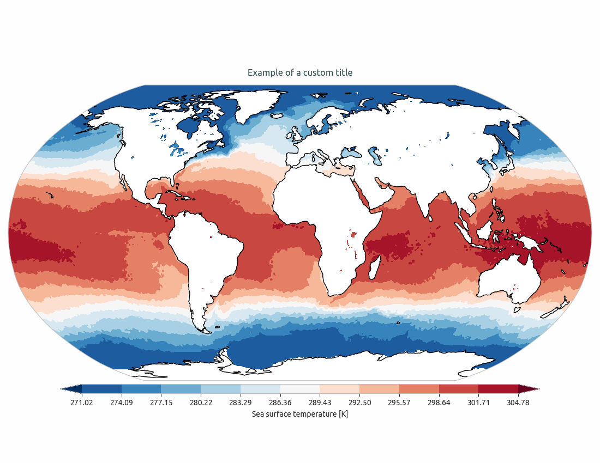
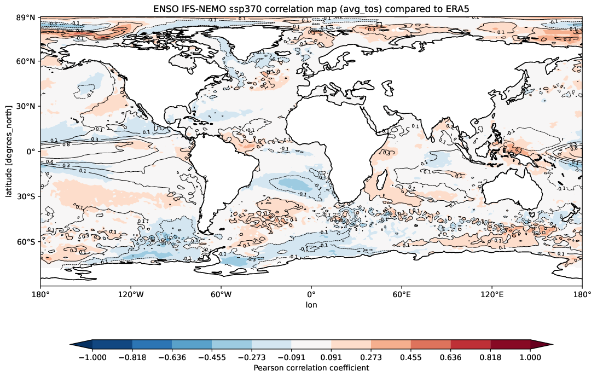
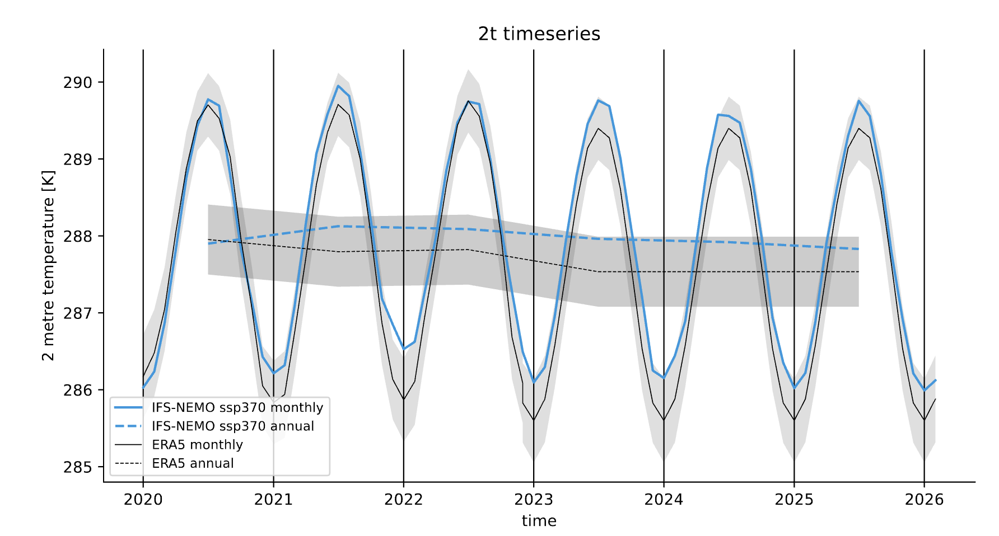
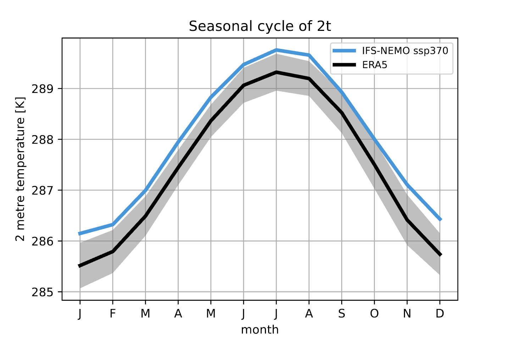
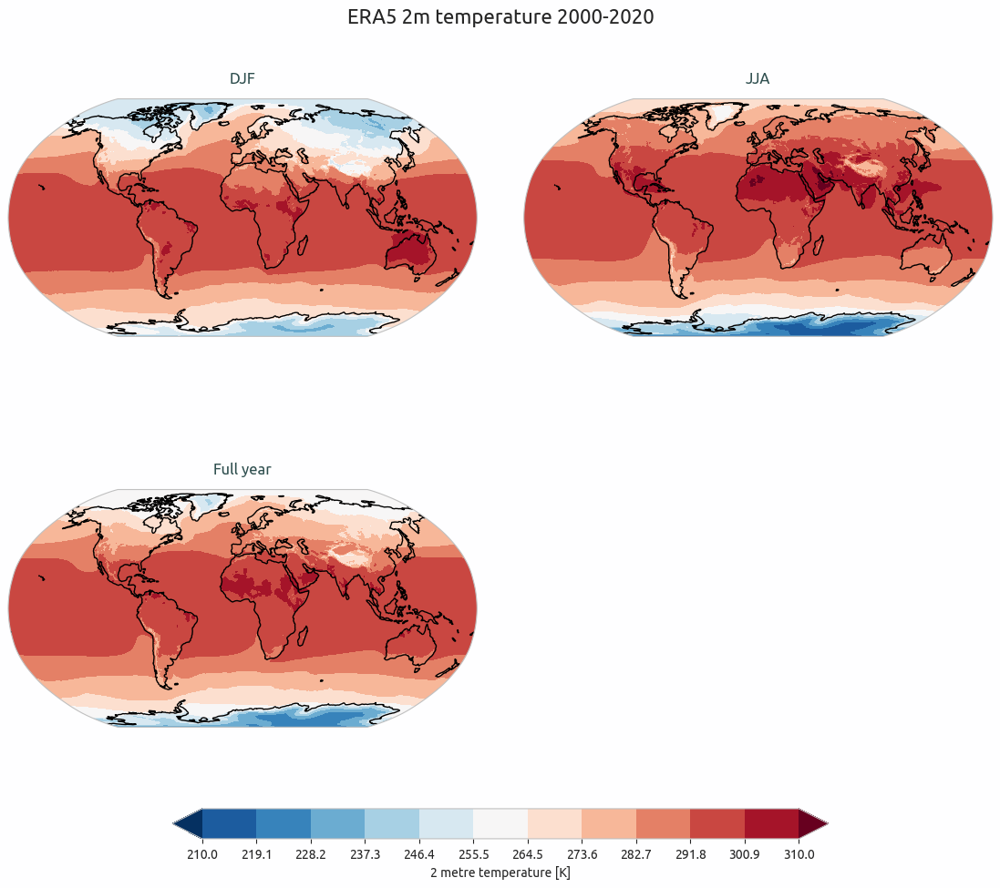

Core Components
===============

Here we describe the core components of the AQUA library.
Specifically with core components we refer to the code contained in the folder ``aqua``.
These are tools that are used to read, process and visualize data, not specific of a single diagnostic.
Some extra functionalities can be found in the :ref:`advanced-topics` section.

The Reader class
----------------

The ``Reader`` class provides AQUA access to data, developed to offer a centralized common data access point.
AQUA ``Reader`` can, in fact, access different file formats and data from the FDB or intake catalogues, 
and delivers xarray objects.
On top of data access, the ``Reader`` is also able to perform multiple operations on the data:
interpolation and regridding, spatial and temporal averaging and metadata correction. 
These are described in the following sections.
The ``Reader`` class is also able to perform parallel processing and to stream data,
since high-resolution data can be too large to be loaded in memory all at once
and it may be necessary to process data in chunks or even step by step.

Input and Output formats
^^^^^^^^^^^^^^^^^^^^^^^^

AQUA supports a variety of climate data file input formats:

- **NetCDF**
- **GRIB** files
- **Zarr**
- **FDB** GRIB

After the data are retrieved, the ``Reader`` class returns an xarray object,
specifically an ``xarray.Dataset``, where only the metadata are loaded in memory.

.. note::
    Since metadata are the minimum information needed to load the data and prepare the processing,
    large sets of numerous NetCDF files are easy to read, but they may require
    to open a large amount of data to be able to check all the metadata.
    We then suggest, if low performance is experienced, to use the Zarr format
    on top of the NetCDF format, to `significantly improve the performance <https://ui.adsabs.harvard.edu/abs/2021AGUFMIN15A..08P/abstract>`_
    of the data access.

Catalogue Exploration
^^^^^^^^^^^^^^^^^^^^^

To check what is available in the catalogue, we can use the ``inspect_catalogue()`` function.
Three hierarchical layer structures describe each dataset.
At the top level, there are *models* (keyword ``model``) (e.g., ICON, IFS-NEMO, IFS-FESOM, etc.). 
Each model has different *experiments* (keyword ``exp``) and each experiment can have different *sources* (keyword ``source``).

Calling, for example:

.. code-block:: python

    from aqua import inspect_catalogue
    inspect_catalogue(model='CERES')

will return experiments available in the catalogue for model CERES.

.. warning::
    The ``inspect_catalogue()`` and the ``Reader`` are based on the machine and AQUA path configuration.
    If you don't find a source you're expecting, please check these are correctly set (see :ref:`getting_started`).

If you want to have a complete overview of the sources available in the catalogue, you can use the ``catalogue()`` function.
This will return a list of all the sources available in the catalogue, listed by model and experiment.

Reader basic usage
^^^^^^^^^^^^^^^^^^

Once you know which dataset you want to access, a call to the ``Reader`` can be done.
The basic call to the ``Reader`` is:

.. code-block:: python

    from aqua import Reader
    reader = Reader(model='IFS-NEMO', exp='historical-1990', source='lra-r100-monthly')
    data = reader.retrieve()

This will return a ``Reader`` object that can be used to access the data.
The ``retrieve()`` method will return an ``xarray.Dataset`` to be used for further processing.

.. note::
    The basic call enables fixer, area and time average functionalities, but no regridding or streaming.
    To have a complete overview of the available options, please check the :doc:`api_reference`.

If some information about the data is needed, it is possible to use the ``info()`` method of the ``Reader`` class.

.. warning::
    Every ``Reader`` instance carries information about the grids and fixes of the retrieved data.
    If you're retrieving data from many sources, please instantiate a new ``Reader`` for each source.

Dask and Iterator access
^^^^^^^^^^^^^^^^^^^^^^^^

The standard usage of the ``Reader`` class will load metadata in memory and
make the data available for processing.
This is the standard behaviour of the ``Reader`` class, where ``xarray`` and ``dask``
capabilities are used to retrieve the data.

This allows to fully process also large datasets using dask lazy and parallel processing capabilities.
However, for specific testing or development needs,
the ``Reader`` class is also able to allow a streaming of data, 
where the data are loaded in chunks and processed step by step.
Please check the :ref:`iterators` section for more details.

.. note::
    Dask access to data is available also for FDB data.
    Since a specific intake driver has been developed, if you're adding new FDB sources to the catalogue,
    we suggest to read the :ref:`FDB_dask` section.

Regrid and interpolation capabilities
-------------------------------------

AQUA provides functions to interpolate and regrid data to match the spatial resolution of different datasets. 
AQUA regridding functionalities are based on the external tool `smmregrid <https://github.com/jhardenberg/smmregrid>`_ which 
operates sparse matrix computation based on pre-computed weights.

Basic usage
^^^^^^^^^^^

When the ``Reader`` is called, if regrid functionalities are needed, the target grid has to be specified
during the class initialization:

.. code-block:: python

    reader = Reader(model='IFS-NEMO', exp='historical-1990', source='hourly-native-atm2d',
                    regrid='r100')
    data = reader.retrieve()
    data_r = reader.regrid(data)

This will return an ``xarray.Dataset`` with the data lazily regridded to the target grid.
We can then use the ``data_r`` object for further processing and the data
will be loaded in memory only when necessary, allowing for further subsetting and processing.

Concept
^^^^^^^

The idea of the regridder is first to generate the weights for the interpolation and
then to use them for each regridding operation. 
The reader generates the regridding weights automatically (with CDO) if not already
existent and stored in a directory specified in the ``config/machine/<machine-name>/catalog.yaml`` file.
A list of predefined target grids (only regular lon-lat for now) is available in the ``config/grids/default.yaml`` file.
For example, ``r100`` is a regular grid at 1° resolution, ``r005`` at 0.05°, etc.

.. note::
    The currently defined target grids follow the convention that for example a 1° grid (``r100``) has 360x180 points centered 
    in latitude between 89.5 and -89.5 degrees. Notice that an alternative grid definition with 360x181 points,
    centered between 90 and -90 degrees is sometimes used in the field. If you need sucha a grid please add an additional definition
    to the ``config/grids`` folder with a different grid name (for example ``r100a``).

In other words, weights are computed externally by CDO (an operation that needs to be done only once) and 
then stored on the machine so that further operations are considerably fast. 

Such an approach has two main advantages:

1. All operations are done in memory so that no I/O is required, and the operations are faster than with CDO
2. Operations can be easily parallelized with Dask, bringing further speedup.

.. note::
    If you're using AQUA on a shared machine, please check if the regridding weights
    are already available.

.. note::
    In the long term, it will be possible to support also pre-computed weights from other interpolation software,
    such as `ESMF <https://earthsystemmodeling.org/>`_ or `MIR <https://github.com/ecmwf/mir>`_.

Vertical interpolation
^^^^^^^^^^^^^^^^^^^^^^

Aside from the horizontal regridding, AQUA offers also the possibility to perform
a simple linear vertical interpolation building  on the capabilities of Xarray.
This is done with the ``vertinterp`` method of the ``Reader`` class.
This can of course be use in the combination of the ``regrid`` method so that it is possible to operate 
both interpolations in a few steps.
Users can also change the unit of the vertical coordinate.

.. code-block:: python

    reader = Reader(model="IFS", exp="tco2559-ng5", source="ICMU_atm3d", regrid='r100')
    data = reader.retrieve()
    field = data['u'].isel(time=slice(0,5)).aqua.regrid()
    interp = field.aqua.vertinterp(levels=[830, 835], units='hPa', method='linear')

.. _fixer:

Fixer functionalities
---------------------

The need of comparing different datasets or observations is very common when evaluating climate models.
However, datasets may have different conventions, units, and even different names for the same variable.
AQUA provides a fixer tool to standardize the data and make them comparable.

The general idea is to convert data from different models to a uniform file format
with the same variable names and units.
The default convention for metadata (for example variable ShortNames) is **GRIB**.

The fixing is done by default when we initialize the ``Reader`` class, 
using the instructions in the ``config/fixes`` folder.

The ``config/fixes`` folder contains fixes in YAML files.
A new fix can be added to the folder and the filename can be freely chosen.
By default, fixes files with the name of the model or the name of the DestinE project are provided.

If you need to develop your own, fixes can be specified in two different ways:

- Using the ``fixer_name`` definitions, to be then provided as a metadata in the catalogue entry.
  This represents fixes that have a common nickname which can be used in multiple sources when defining the catalogue.
  There is the possibility of specifing a **parent** fix so that a fix can be re-used with minor corrections,
  merging small changes to a larger ``fixer_name``.
- Using the source-based definition.
  Each source can have its own specific fixes.
  These are used only if a ``fixer_name`` is not specified for the source.

.. warning::  
    Please note that the source-based definition is the older AQUA implementation and will be deprecated
    in favour of the new approach described above.
    We strongly suggest to use the new approach for new fixes.

.. note::
    If no ``fixer_name`` is provided and ``fix`` is set to ``True``, the code will look for a
    ``fixer_name`` called ``<MODEL_NAME>-default``.

Please note that the ``default.yaml`` is reserved to define a few of useful tools:

- the default ``data_model`` (See :ref:`coord-fix`).
- the list of units that should be added to the default MetPy unit list. 
- A series of nicknames (``shortname``) for units to be replaced in the fixes yaml file.

Concept
^^^^^^^

The fixer performs a range of operations on data:

- adopts a **common data model** for coordinates (default is the CDS common data model):
  names of coordinates and dimensions (lon, lat, etc.),
  coordinate units and direction, name (and meaning) of the time dimension. (See :ref:`coord-fix` for more details)
- changes variable names deriving the correct metadata from GRIB tables if required.
  The fixer can identify these derived variables by their ShortNames and ParamID (ECMWF and WMO eccodes tables are used).
- derives new variables executing trivial operations as multiplication, addition, etc. (See :ref:`metadata-fix` for more details)
  In particular, it derives from accumulated variables like ``tp`` (in mm), the equivalent mean-rate variables
  (like ``mtpr`` in kg m-2 s-1). (See :ref:`metadata-fix` for more details)
- using the ``metpy.units`` module, it is capable of guessing some basic conversions.
  In particular, if a density is missing, it will assume that it is the density of water and will take it into account.
  If there is an extra time unit, it will assume that division by the timestep is needed. 

.. _fix-structure:

Fix structure
^^^^^^^^^^^^^

Here we show an example of a fixer file, including all the possible options:

.. code-block:: yaml

    fixer_name:
        documentation-mother: 
            data_model: ifs
            delete: 
                - bad_variable
            vars:
                mtpr:
                    source: tp
                    grib: true
        documentation-fix:
            parent: documentation-to-merge
            data_model: ifs
            dims:
                cells:
                    source: cells-to-rename
            coords:
                time:
                    source: time-to-rename
            deltat: 3600 # Decumulation info
            jump: month
            vars:
                2t:
                    source: 2t
                    attributes: # new attribute
                        donald: 'duck'
                mtntrf: # Auto unit conversion from eccodes
                    derived: ttr
                    grib: true
                    decumulate: true     
                2t_increased: # Simple formula
                    derived: 2t+1.0
                    grib: true
                # example of derived variable, should be double the normal amount
                mtntrf2:
                    derived: ttr+ttr
                    src_units: J m-2 # Overruling source units
                    decumulate: true  # Test decumulation
                    units: "{radiation_flux}" # overruling units
                    mindate: 1990-09-01T00:00 # setting to NaN all data before this date
                    attributes:
                        # assigning a long_name
                        long_name: Mean top net thermal radiation flux doubled
                        paramId: '999179' # assigning an (invented) paramId

We put together many different fixes, but let's take a look at the 
different sections of the fixer file.

- **documentation-fix**: This is the name of the fixer.
  It is used to identify the fixer and will be used in the entry metadata
  to specify which fixer to use. (See :ref:`add-data` for more details)
- **parent**: a source ``fixer_name`` with which the current fixes have to be merged. 
  In the above example, the ``documentation-fix`` will extend the ``documentation-mother`` fix integrating it. 
- **data_model**: the name of the data model for coordinates. (See :ref:`coord-fix`).
- **coords**: extra coordinates handling if data model is not flexible enough.
  (See :ref:`coord-fix`).
- **dims**: extra dimensions handling if data model is not flexible enough. 
  (See :ref:`coord-fix`).
- **decumulation**: 
    - If only ``deltat`` is specified, all the variables that are considered flux variables
      will be divided by the ``deltat``. This is done automatically based on target and source units.
    - If additionally ``decumulate: true`` is specified for a specific variable,
      a time derivative of the variable will be computed.
      This is tipically done for cumulated fluxes for the IFS model, that are cumulated on a period longer
      than the output saving frequency.
      The additional ``jump`` parameter specifies the period of cumulation.
      Only months are supported at the moment, implying that fluxes are reset at the beginning of each month.
- **vars**: this is the main fixer block, described in detail on the following section :ref:`metadata-fix`.
- **delete**: a list of variable or coordinates that the users want to remove from the output Dataset

.. _metadata-fix:

Metadata Correction
^^^^^^^^^^^^^^^^^^^^

The **vars** block in the ``fixer_name`` represent a list of variables that need
metadata correction: this covers units, names, grib codes, and any other metadata.
In addition, also new variables can be computed from pre-existing variables.

The above-reported section :ref:`fix-structure` provides an exhaustive list of cases. 
In order to create a fix for a specific variable, two approaches are possibile:

- **source**: it will modify an existent variable changing its name (e.g from ``tp`` to ``mtpr``)
- **derived**: it will create a new variable, which can also be obtained with basic operations between
  multiple variables (e.g. getting ``mtntrf2`` from ``ttr`` + ``tsr``). 

.. warning ::
    Please note that only basic operation (sum, division, subtraction and multiplication) are allowed in the ``derived`` block

Then, extra keys can be then specified for `each` variable to allow for further fine tuning:

- **grib**: if set ``True``, the fixer will look for GRIB ShortName associated with the new variable and 
  will retrieve the associated metadata.
- **src_units**: override the source unit in case of specific issues (e.g. units which cannot be processed by MetPy).
- **units**: override the target unit.
- **decumulate**: if set to ``True``, activate the decumulation of the variables
- **attributes**: with this key, it is possible to define a dictionary of attributes to be modified. 
  Please refer to the above example to see the possible implementation. 
- **mindate**: used to set to NaN all data before a specified date. 
  This is useful when dealing with data that are not available for the whole period of interest or which are partially wrong.

.. warning ::
    Recursive fixes (i.e. fixes of fixes) cannot be implemented. For example, it is not possibile to derive a variable from a derived variable

.. _coord-fix:

Data Model and Coordinates Correction
^^^^^^^^^^^^^^^^^^^^^^^^^^^^^^^^^^^^^

The fixer can adopt a common *coordinate data model*
(default is the CDS data model).
If this data model is not appropriate for a specific source,
it is possible to specify a different one in the catalogue.

If the data model coordinate treatment is not enough to fix the coordinates or dimensions,
it is possible to specify a custom fix in the catalogue in the **coords** or **dims** blocks
as shown in section :ref:`fix-structure`.
For example, if the longitude coordinate is called ``longitude`` instead of ``lon``,
it is possible to specify a fix like:

.. code-block:: yaml

    lon:
        source: longitude

This will rename the coordinate to ``lon``.

.. note::
    When possible, prefer a **data model** treatment of coordinates and use the **coords**
    block as second option.

Time Aggregation
----------------

Input data may not be available at the desired time frequency. It is possible to perform time averaging at a given
frequency by using the ``timmean`` method. 

.. code-block:: python

    reader = Reader(model="IFS", exp="tco2559-ng5", source="ICMGG_atm2d")
    data = reader.retrieve()
    daily = reader.timmean(data, freq='daily')

Data have now been averaged at the desired daily timescale.

Some extra options are available:

- ``exclude_incomplete=True``: this flag will remove averaged chunks which are not complete
  (for example, verify  that all the record from each month are available before doing the time mean).
- ``center_time=True``: this flag will center the time coordinate on the mean time window.
- ``time_bounds=True``: this flag can be activated to build time bounds in a similar way to CMOR-like standard.

Detrending
----------

For some analysis, removing from the data a linear trend can be helpful to highlight the internal variability.
The ``detrend`` method can be used as a high-level wrapper of xarray functionalities to achieve this goal.

.. code-block:: python

    reader = Reader(model="IFS", exp="tco2559-ng5", source="ICMGG_atm2d")
    data = reader.retrieve()
    daily = reader.detrend(data['2t'], dim='time')

In this way, linear trend is removed from each grid point of the original dataset along the time dimension. 
Other dimension can be targeted too, although with limited physical meaning. 
Of course, it can be used in collaboration with temporal and spatial averaging. Higher order polynominial fits are available too.

Some options includes:

- ``degree``: this will define with an integer the order of the polynominial fit. Default is 1, i.e. linear Detrending
- ``skipna==True``: removing the NaN from the fit. Default is True. 

.. warning::
    Detrending might lead to incorrect results if there is not an equal amount of time elements (e.g. same amount of months or days) in the dataset.

Spatial Averaging
-----------------

When we instantiate the ``Reader`` object, grid areas for the source files are computed if not already available. 
After this, we can use them for spatial averaging using the ``fldmean()`` method, obtaining time series of global (field) averages.
For example, if we run the following commands:

.. code-block:: python

    tprate = data.tprate
    global_mean = reader.fldmean(tprate)

we get a time series of the global average ``tprate``.

It is also possible to apply a regional section to the domain before performing the averaging:

.. code-block:: python

    tprate = data.tprate
    global_mean = reader.fldmean(tprate, lon_limits=[-50, 50], lat_limits=[-10,20])

.. warning ::
    In order to apply an area selection the data Xarray must include ``lon`` and ``lat`` as coordinates.
    It can work also on unstructured grids, but information on coordinates must be available.
    If the dataset does not include these coordinates, this can be achieved with the fixer
    described in the :ref:`fixer` section.

.. _time-selection:

Time selection
--------------

Even if slicing your data after the ``retrieve()`` method is an easy task,
being able to perform a time selecetion during the Reader initialization
can speed up your code, having less metadata to explore.
For this reason ``startdate`` and ``enddate`` options are available both
during the Reader initialization and the ``retrieve()`` method to subselect
immediatly only a chunck of data.

.. note::
    If you're streaming data check the section :ref:`streaming` to have an
    overview of the behaviour of the Reader with these options.

.. _lev-selection:

Level selection
---------------

Similarly to :ref:`time-selection`, level selection is a trivial operation,
but when dealing with high-resolution 3D datasets, only ask for the
required levels can speed up the retrieve process.

When reading 3D data it is possible to specify already during ``retrieve()``
which levels to select using the ``level`` keyword.
The levels are specified in the same units as they are stored in the archive
(for example in hPa for atmospheric IFS data,
but an index for NEMO data in the FDB archive).

.. note::
    In the case of FDB data this presents the great advantage that a significantly reduced request will be read from the FDB 
    (by default all levels would be read for each timestep even if later a ``sel()`` or ``isel()`` selection
    is performed on the XArray).

.. warning::
    If you're dealing with level selection and regridding, please take a look at 
    the section :ref:`lev-selection-regrid`.

.. _streaming:

Streaming of data
-----------------

The Reader class includes the ability to simulate data streaming to retrieve chunks
of data of a specific time length.

Basic usage
^^^^^^^^^^^

To activate the streaming mode the user should specify the argument ``streaming=True``
in the Reader initialization.
The user can also choose the length of the data chunk with the ``aggregation`` keyword
(e.g. in pandas notation, or with aliases as ``daily``, ``monthly`` etc. or ``days``, ``months`` etc.).
The default is ``S`` (step), i.e. single saved timesteps are read at each iteration.
The user can also specify the desired initial and final dates with the keywords ``startdate`` and ``enddate``.

If, for example, we want to stream the data every three days from ``'2020-05-01'``, we need to call:

.. code-block:: python

    reader = Reader(model="IFS", exp= "tco2559-ng5", source="ICMGG_atm2d",
                    streaming=True, aggregation = '3D', startdate = '2020-05-01')    
    data = reader.retrieve()

The data available with the first retrieve will be only 3 days of the available times.
The ``retrieve()`` method can then be called multiple times,
returning a new chunk of 3 days of data, until all data are streamed.
The function will automatically determine the appropriate start and end points for each chunk based on
the internal state of the streaming process.

If we want to reset the state of the streaming process, we can call the ``reset_stream()`` method.

Iterator streaming
^^^^^^^^^^^^^^^^^^

Another possibility to deal with data streaming is to use the argument
``stream_generator=True`` in the Reader initialization:

.. code-block:: python

    reader = Reader(model="IFS", exp= "tco2559-ng5", source="ICMGG_atm2d",
                    stream_generator = 'True', aggregation = 'monthly')
    data_gen = reader.retrieve()
    
``data_gen`` is now a generator object that yields the requested one-month-long chunks of data
(See :ref:`iterators` for more info).
We can do operations with them by iterating on the generator object like:

.. code-block:: python

    for data in data_gen:
        # Do something with the data

.. _accessors:

Accessors
---------

AQUA also provides a special ``aqua`` accessor to Xarray which allows
to call most functions and methods of the reader
class as if they were methods of a DataArray or Dataset.

Basic usage
^^^^^^^^^^^

Reader methods like ``reader.regrid()`` or functions like ``plot_single_map()``
can now also be accessed by appending the suffix ``aqua`` to a
DataArray or Dataset, followed by the function of interest,
like in ``data.aqua.regrid()``.

This means that instead of writing:

.. code-block:: python

    reader.fldmean(reader.timmean(data.tcc, freq="Y"))

we can write:

.. code-block:: python

    data.tcc.aqua.timmean(freq="Y").aqua.fldmean()

.. note::
    The accessor always assumes that the Reader instance to be used is either
    the one with which a Dataset was created or, for new derived objects and for **DataArrays of a Datasets**,
    the last instantiated Reader or the last use of the ``retrieve()`` method.
    This means that if more than one reader instance is used (for example to compare different datasets)
    we recommend not to use the accessor.

Usage with multiple Reader instances
^^^^^^^^^^^^^^^^^^^^^^^^^^^^^^^^^^^^

As an alternative the Reader class contains a special ``set_default()`` method which sets that reader
as an accessor default in the following.
The accessor itself also has a ``set_default()`` method
(accepting a reader instance as an argument) which sets the default and returns the same object.

Usage examples when multiple readers are used:

.. code-block:: python

    from aqua import Reader
    reader1=Reader(model="IFS", exp="test-tco79", source="short", regrid="r100")  # the default is now reader1
    reader2=Reader(model="IFS", exp="test-tco79", source="short", regrid="r200")  # the default is now reader2
    data1 = reader1.retrieve()  # the default is now reader1 
    data2 = reader2.retrieve()  # the default is now reader2
    reader1.set_default()  # the default is now reader1 
    data1r = data1.aqua.regrid()
    data2r = data2.aqua.regrid()  # data2 was created by retrieve(), so it remembers its default reader
    data2r = data2['2t'].aqua.set_default(reader2).aqua.regrid()  # the default is set to reader2 before using a method

Parallel Processing
-------------------

Since most of the objects in AQUA are based on ``xarray``, you can use parallel processing capabilities provided by 
``xarray`` through integration with ``dask`` to speed up the execution of data processing tasks.

For example, if you are working with AQUA interactively
in a Jupyter Notebook, you can start a dask cluster to parallelize your computations.

.. code-block:: python

    from dask.distributed import Client
    import dask
    dask.config.config.get('distributed').get('dashboard').update({'link':'{JUPYTERHUB_SERVICE_PREFIX}/proxy/{port}/status'})

    client = Client(n_workers=40, threads_per_worker=1, memory_limit='5GB')
    client

The above code will start a dask cluster with 40 workers and one thread per worker.

AQUA also provides a simple way to move the computation done by dask to a compute node on your HPC system.
The description of this feature is provided in the section :ref:`slurm`.

Graphic tools
-------------

The *aqua.graphics* module provides a set of simple functions to easily plot the result of analysis done within AQUA.

Single map
^^^^^^^^^^

A function called ``plot_single_map()`` is provided with many options to customize the plot.

The function takes as input an xarray.DataArray, with a single timestep to be selected
before calling the function. The function will then plot the map of the variable and,
if no other option is provided, will adapt colorbar, title and labels to the attributes
of the input DataArray.

In the following example we plot an sst map from the first timestep of ERA5 reanalysis:

.. code-block:: python
    
    from aqua import Reader, plot_single_map

    reader = Reader(model='ERA5', exp='era5', source='monthly')
    sst = reader.retrieve(var=["sst"])
    sst_plot = sst["sst"].isel(time=0)

    plot_single_map(sst_plot, title="Example of a custom title", filename="example",
                    outputdir=".", format="png", dpi=300, save=True)

This will produce the following plot:

Single map with differences
^^^^^^^^^^^^^^^^^^^^^^^^^^^

A function called ``plot_single_map_diff()`` is provided with many options to customize the plot.

The function is built as an expansion of the ``plot_single_map()`` function, so that arguments and options are similar.
The function takes as input two xarray.DataArray, with a single timestep.

The function will plot as colormap or contour filled map the difference between the two input DataArray (the first one minus the second one).
Additionally a contour line map is plotted with the first input DataArray, to show the original data.

    Example of a ``plot_single_map_diff()`` output done with the :ref:`teleconnections`.
    The map shows the correlation for the ENSO teleconnection between IFS-NEMO scenario run and ERA5 reanalysis.

Time series
^^^^^^^^^^^

A function called ``plot_timeseries()`` is provided with many options to customize the plot.
The function is built to plot time series of a single variable,
with the possibility to plot multiple lines for different models and a special line for a reference dataset.
The reference dataset can have a representation of the uncertainty over time.

By default the function is built to be able to plot monthly and yearly time series, as required by the :ref:`global_timeseries` diagnostic.

The function takes as data input:

- **monthly_data**: a (list of) xarray.DataArray, each one representing the monthly time series of a model.
- **annual_data**: a (list of) xarray.DataArray, each one representing the annual time series of a model.
- **ref_monthly_data**: a xarray.DataArray representing the monthly time series of the reference dataset.
- **ref_annual_data**: a xarray.DataArray representing the annual time series of the reference dataset.
- **std_monthly_data**: a xarray.DataArray representing the monthly values of the standard deviation of the reference dataset.
- **std_annual_data**: a xarray.DataArray representing the annual values of the standard deviation of the reference dataset.

The function will automatically plot what is available, so it is possible to plot only monthly or only yearly time series, with or without a reference dataset.

    Example of a ``plot_timeseries()`` output done with the :ref:`global_timeseries`.
    The plot shows the global mean 2 meters temperature time series for the IFS-NEMO scenario and the ERA5 reference dataset.

Seasonal cycle
^^^^^^^^^^^^^^

A function called ``plot_seasonalcycle()`` is provided with many options to customize the plot.

The function takes as data input:

- **data**: a xarray.DataArray representing the seasonal cycle of a variable.
- **ref_data**: a xarray.DataArray representing the seasonal cycle of the reference dataset.
- **std_data**: a xarray.DataArray representing the standard deviation of the seasonal cycle of the reference dataset.

The function will automatically plot what is available, so it is possible to plot only the seasonal cycle, with or without a reference dataset.

    Example of a ``plot_seasonalcycle()`` output done with the :ref:`global_timeseries`.
    The plot shows the seasonal cycle of the 2 meters temperature for the IFS-NEMO scenario and the ERA5 reference dataset.

Multiple maps
^^^^^^^^^^^^^

A function called ``plot_maps()`` is provided with many options to customize the plot.
The function takes as input a list of xarray.DataArray, each one representing a map.
It is built to plot multiple maps in a single figure, with a shared colorbar.
This can be userdefined or evaluated automatically.
Figsize can be adapted and the number of plots and their position is automatically evaluated.

    Example of a ``plot_maps()`` output.