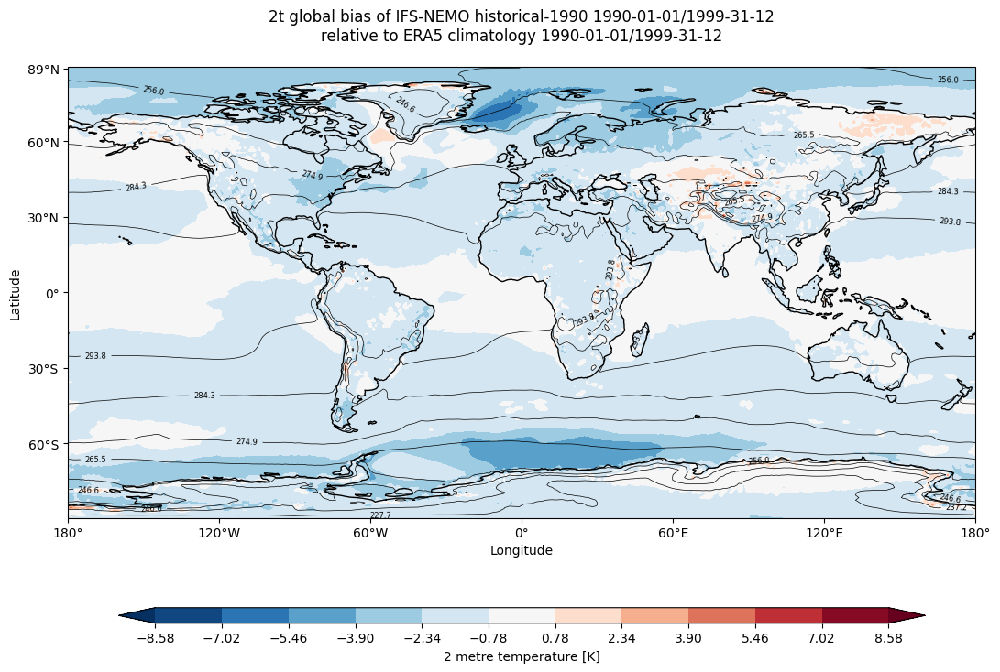
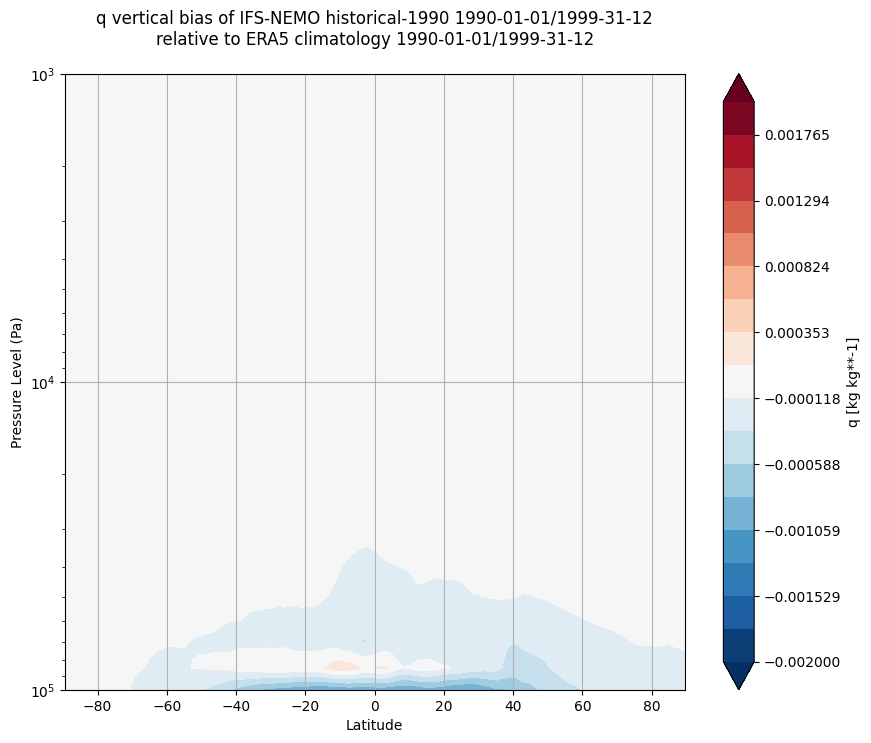

Global Biases Diagnostic
========================

Description
-----------

The `GlobalBiases` class is a tool for analyzing and visualizing 2D biases between two datasets. 
It enables a comparative analysis where one dataset is treated as the reference, often observational data like ERA5.
However, it can also be used to compare two model datasets, making it suitable for examining differences between historical and scenario experiments.

This class provides functionality for bias analysis, including the ability to:
- Plot bias maps to visualize spatial variations.
- Analyze seasonal variations in biases.
- Generate vertical profiles to assess biases across pressure levels.

Structure
---------

* ``global_biases.py``: contains the GlobalBiases class
* ``cli_global_biases.py``: the command line interface (CLI) script to run the diagnostic.

Input variables 
---------------

The diagnostic requires the variables that the user wants to analyse. 
A list of the variables that are compared automatically when running the full diagnostic is provided in the configuration files
available in the ``config/diagnostics/global_biases`` directory.

Some of the variables that are tipically used in this diagnostic are:

* 2m temperature (2t)
* Total Precipitation (tprate)
* Zonal and meridional wind (u, v)
* Specific humidity (q)

The data we retrieve through the provided functions have monthly timesteps and a 1x1 deg resolution via the Low Resolution Archive.
A higher resolution is not necessary for this diagnostic.

Basic usage
-----------

The basic usage of this diagnostic is explained with a working example in the notebook provided in the ``notebooks/diagnostics/global_biases`` directory.
The basic structure of the analysis is the following:

.. code-block:: python

    from aqua import Reader
    from aqua.diagnostics import GlobalBiases

    #define and retrieve the data to use for the analysis
    reader_ifs_nemo = Reader(model = 'IFS-NEMO', exp = 'historical-1990', source = 'lra-r100-monthly')
    data_ifs_nemo = reader_ifs_nemo.retrieve()

    reader_era5 = Reader(model="ERA5", exp="era5", source="monthly")
    data_era5 = reader_era5.retrieve()

    global_biases = GlobalBiases(data=data_ifs_nemo, data_ref=data_era5, var_name='2t', loglevel = 'INFO',
                                 model="IFS-NEMO", exp="historical-1990", model_obs="ERA5")

    global_biases.plot_bias()

The user can also define the start and end date of the analysis and the reference dataset.

.. note::

    A ``catalogs`` argument can be passed to the class to define the catalogs to use for the analysis.
    If not provided, the ``Reader`` will identify the catalogs to use based on the models, experiments and sources provided.

CLI usage
---------

The diagnostic can be run from the command line interface (CLI) by running the following command:

.. code-block:: bash

    cd $AQUA/src/aqua_diagnostics/global_biases
    python cli_global_biases.py --config_file <path_to_config_file>

Additionally the CLI can be run with the following optional arguments:

- ``--config``, ``-c``: Path to the configuration file.
- ``--nworkers``, ``-n``: Number of workers to use for parallel processing.
- ``--loglevel``, ``-l``: Logging level. Default is ``WARNING``.
- ``--catalog``: Catalog to use for the analysis. It can be defined in the config file.
- ``--model``: Model to analyse. It can be defined in the config file.
- ``--exp``: Experiment to analyse. It can be defined in the config file.
- ``--source``: Source to analyse. It can be defined in the config file.
- ``--outputdir``: Output directory for the plots.
- ``--cluster``: Dask cluster address.

Config file structure
^^^^^^^^^^^^^^^^^^^^^

The configuration file is a YAML file that contains the following information:

* ``data`` and ``obs`` : dictionaries with the information about the model and reference data to use for the analysis.

.. code-block:: yaml

    data:
      catalog: null
      model: 'IFS-NEMO'
      exp: 'historical-1990'
      source: 'lra-r100-monthly'

    obs: 
      catalog: null
      model: 'ERA5'
      exp: 'era5'
      source: 'monthly'

* ``output``: a block describing the details of the output. Is contains:

    * ``outputdir``: the output directory for the plots.
    * ``rebuild``: a boolean that enables the rebuilding of the plots.
    * ``filename_keys``: a list of keys for constructing the output filenames.
    * ``save_netcdf``: a boolean that enables the saving of the plots in NetCDF format.
    * ``save_pdf``: a boolean that enables the saving of the plots in pdf format.
    * ``save_png``: a boolean that enables the saving of the plots in png format.
    * ``dpi``: the resolution of the plots.

* ``diagnostic_attributes``: a block with the following information:

    * ``variables``: the list of variables to analyse.
    * ``plev``: the specific pressure level to analyse (default: null)
    * ``seasons``: a boolean that enables the seasonal analysis.
    * ``seasons_stat``: the statistic to use for the seasonal analysis (e.g., 'mean').
    * ``vertical``: a boolean that enables the vertical profiles.
    * ``regrid``: the grid you want your data to be regridded to (e.g. 'r100').
    * ``startdate_data``: the start date of the dataset.
    * ``enddate_data``: the end date of the dataset.
    * ``startdate_obs``: the start date of the reference dataset.
    * ``enddate_obs``: the end date of the reference dataset.

* ``biases_plot_params``: a block defining colorbar limits for plotting biases. Each variable can have its own range.

Output
------

The diagnostic generates three types of plots for each variable:

  * The global bias of the model compared to the reference dataset.
  * The global bias of the model compared to the reference dataset for each season.
  * If the variable is 3d, a vertical profile of the bias of the model compared to the reference dataset at each pressure level.

These plots  are saved in a PDF and png format as well as NetCDF files. 

Observations
------------

The diagnostic uses ERA5 as a default reference dataset for the bias analysis.
Custom reference datasets can be used.

Example Plots
-------------

All these plots can be produced by running the notebooks in the ``notebooks`` directory on LUMI HPC.

    
    Global mean temperature bias of IFS-NEMO historical-1990 with respect to ERA5 climatology.

.. figure:: figures/seasonal_bias.png
    :align: center
    :width: 100%

    Seasonal temperature bias of IFS-NEMO historical-1990 with respect to ERA5 climatology.

    Vertical bias of q  of IFS-NEMO historical-1990 with respect to ERA climatology.

Available demo notebooks
------------------------

Notebooks are stored in ``diagnostics/global_biases/notebooks``:

* `global_biases.ipynb <https://github.com/DestinE-Climate-DT/AQUA/blob/main/notebooks/diagnostics/global_biases/global_biases.ipynb>`_

Detailed API
------------

This section provides a detailed reference for the Application Programming Interface (API) of the ``timeseries`` diagnostic,
produced from the diagnostic function docstrings.

.. automodule:: aqua.diagnostics.global_biases
    :members:
    :undoc-members:
    :show-inheritance:
