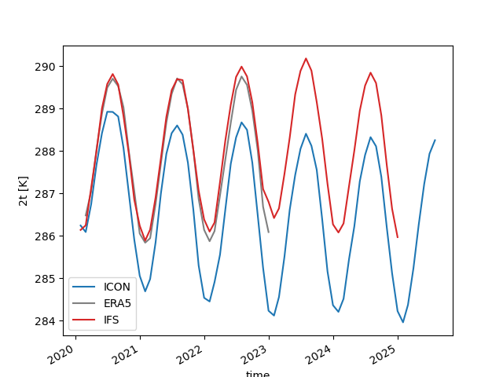

.. _global_mean_timeseries:

Global mean time series
=======================

Description
-----------

This diagnostic computes and plots various (atmospheric) global mean time series.

Structure
-----------

* ``README.md``: a readme file which contains some technical information on how to install the diagnostic and its environment.
* ``functions.py``: a python file in which the ``plot_timeseries()`` and ``plot_gregory`` functions are implemented
* ``notebooks/global_time_series.ipynb``: an ipython notebook which shows the usage of both functions
* ``cli/cli_global_time_series.py``: a CLI to run the diagnostic in an automated way
* ``cli/config.yaml``: a configuration file to configure the CLI

Input variables example
------------------------

* ``2t``     (2 metre temperature, GRIB paramid 167)
* ``mtntrf``     (Outgoing longwave radiation at TOA, GRIB paramid 172179)
* ``mtnsrf``     (Net shortwave radiation at TOA, GRIB paramid 172178)

Output
------

The diagnostic producestwo plots:

* ``timeseries.png``  A comparison of ICON and IFS global mean temperature
* ``gregory.png``     A Gregory-like plot to analyse model drift in ICON

and two data files:

* ``icon_2t_mean.nc`` Data for Gregory-like plot to analyse model drift in ICON
* ``ifs_2t_mean.nc``  Data for Gregory-like plot to analyse model drift in IFS

Observations
------------

The diagnostic has an optional dependence on the ERA5 reanalysis dataset.

Example Plot(s)
---------------

    Comparison of global mean air temperature in IFS, ICON, and the ERA5 reanalysis for NextGEMS Cycle3 simulations.

Available demo notebooks
------------------------

Notebooks are stored in diagnostics/global_time_series/notebooks

* `global_mean_time_series.ipynb <https://github.com/oloapinivad/AQUA/blob/main/diagnostics/global_time_series/notebooks/global_mean_time_series.ipynb>`_

Detailed API
------------

This section provides a detailed reference for the Application Programming Interface (API) of the "global_mean_timeseries" diagnostic,
produced from the diagnostic function docstrings.

.. automodule:: global_time_series
    :members:
    :undoc-members:
    :show-inheritance:
