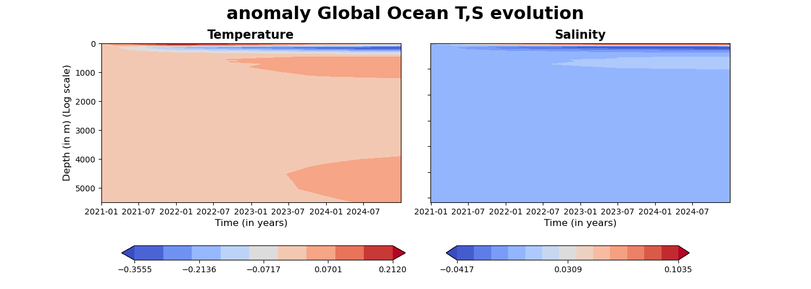
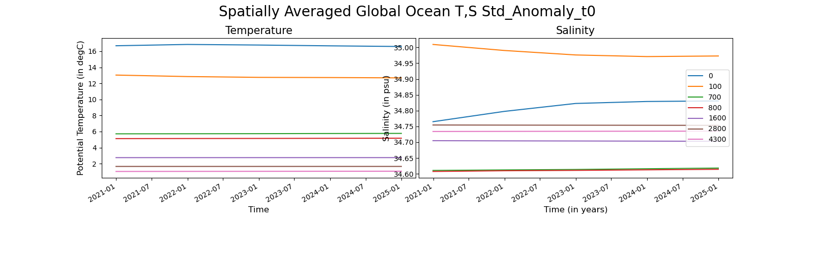
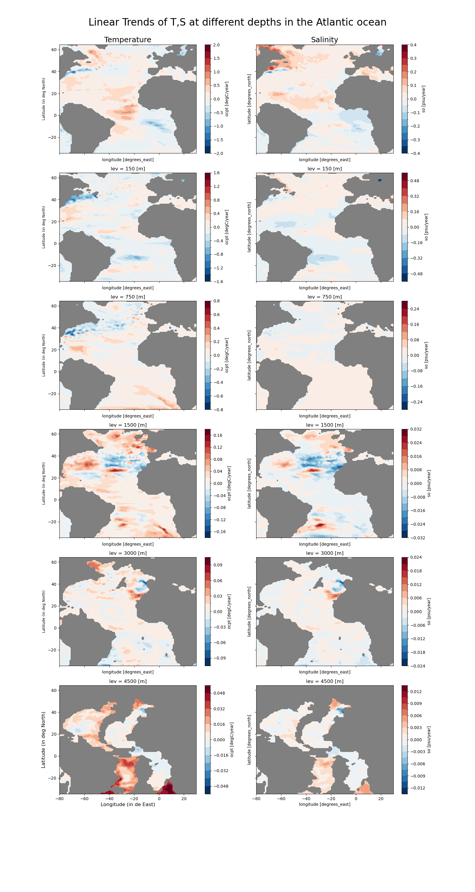
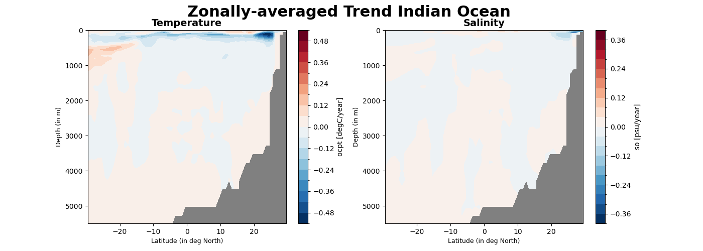

Global Ocean
================

Description
-----------

This package provides a set of diagnostics to track evolution and trends of temperature and salinity in the global and other regional oceans, using a battery of hovmoller figures, time series plots and maps of regional temporal trends at different depths of the ocean.

All these diagnostics are produced in a consistent way, for a selected model simulation.

Structure
-----------

The global_ocean diagnostic follows a class structure and consists of the files:

* `global_ocean.py`: a python file which contains functions that are called and used in the global_ocean class;
* `notebooks/global_ocean.ipynb`: an ipython notebook which has the example of how to use the package;
* `README.md` : a readme file which contains some tecnical information on how to install the global_ocean diagnostic and its environment. 

Input variables example
------------------------

* ocpt (Ocean potential temperature, GRIB paramid 150129)
* so     (Sea water practical salinity, GRIB paramid 151130)

Output 
------

This diagnostic exports all the data has has been used to create the different figures.
  

Functions used 
---------------
hovmoller_lev_time_plot: This function requires data, a region, and the type of data processing. And it produces a Hovmoller plot of regionally averaged temperature and salinity with the selected preprocessing of the data (e.g. whether anomalies are computed and how, and whether they are normalised or not). The region name supports all the major oceans and seas, in case users require a custom region, they can fill in the values of latitude, and longitude in the boxes as desired.

.. code-block:: python

    hovmoller_lev_time_plot(data, region= "Global Ocean",type = 'FullValue', latS, latN, lonE, lonW, output= True, output_dir= "output")

time_series_multilevs: This function requires data, a region,  the type of data processing and optional depth levels. And it produces time series plots of regionally averaged temperature and salinity with the selected preprocessing of the data for a predefined or customised list of vertical levels. The region name supports all the major oceans and seas, in case users require a custom region, they can fill in the values of latitude, and longitude in the boxes.

.. code-block:: python

    time_series_multilevs(data,'Global Ocean', type="Anomaly",customise_level=False, levels=list,output = True,  output_dir="output")

multilevel_t_s_trend_plot: This function requires data, a region and optional depth levels. It produces lon-lat maps of linear temporal trends of temperature and salinity over the selected region for a predefined or customised list of vertical levels. The region name supports all the major oceans and seas, in case users require a custom region, they can fill in the values of latitude, and longitude in the boxes.

.. code-block:: python

    multilevel_t_s_trend_plot(data,'Atlantics Ocean', customise_level=False, levels=None,
                            output= True, output_dir = "output")

zonal_mean_trend_plot: This function requires data, a region. It produces plots of zonally averaged linear temporal trends plot of temperature and salinity as a function of depth and latitud. The zonal average is produced over the selected region, whose name supports all the major oceans and seas; in case users require a custom region, they can fill in the values of latitude and longitude in the boxes.

.. code-block:: python

   zonal_mean_trend_plot(data, region= "Indian Ocean ", output= True, output_dir="output")

Methods used 
---------------
All regional averages has been produced with area weights

Temporal trends are computed as linear trends and estimated over the whole temporal span of the dataset

Observations  
---------------
This set of diagnostics has been developed to monitor potential drifts and initialization shock in the models. Observations do not provide any added value for the identification of the drift and were not considered

References
----------

A code to compute very efficiently the linear trends has been adapted from this website:
https://stackoverflow.com/questions/52108417/how-to-apply-linear-regression-to-every-pixel-in-a-large-multi-dimensional-array

Example Plot(s)
---------------

This is an example of one of the hovmoller T,S figures

This is an example of the multipanel plots of the spatially averaged T,S timeseries at different levels

This is an example of the multi-panel plots of lon-lat maps of temporal trends in T,S at different levels

This is an example of the plots of lat-depth maps of temporal trends in T,S

Available demo notebooks
------------------------

Notebooks are stored in diagnostics/global_oceandiagnostic/notebooks

* `global_ocean.ipynb <https://github.com/oloapinivad/AQUA/blob/devel/ocean/diagnostics/global_ocean/notebooks/global_ocean.ipynb>`_
        
Detailed API
------------

This section provides a detailed reference for the Application Programming Interface (API) of the "global_ocean" diagnostic,
produced from the diagnostic function docstrings.

.. automodule:: global_ocean
    :members:
    :undoc-members:
    :show-inheritance:
