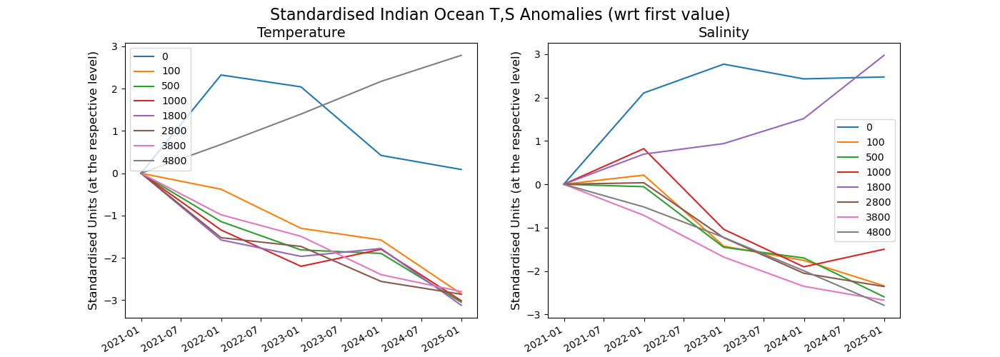

Global Ocean
================

Description
-----------

Structure
-----------

The global_ocean diagnostic follows a class structure and consists of the files:

* `global_ocean_class.py`: a python file in which the global_oceanDiagnostic class constructor and the other class methods are included;
* `global_ocean_global_ocean_func.py`: a python file which contains functions that are called and used in the global_ocean class;
* `env-global_ocean.yml`: a yaml file with the required dependencies for the global_ocean diagnostic;
* `notebooks/global_ocean_class_global_mean.ipynb`: an ipython notebook which uses the dymmy class and its methods;
* `notebooks/global_ocean_class_basin_T_S_means.ipynb`: an ipython notebook which uses the dymmy class and its methods;
* `README.md` : a readme file which contains some tecnical information on how to install the global_ocean diagnostic and its environment. 

Input variables example
------------------------

* `thetao` (total precipitation rate, GRIB paramid 151129)
* `so`     (2 metre temperature, GRIB pramid 3088)

Output 
------

List here types of files/datasets produced by the diagnostic

Methods used
------------

Examples from the GlobaloOceanDiagnostic class contained in the global_ocean_class.py file:

* "global_oceanDiagnostic": the global_ocean diagnostic class;
* "retrieve": method to retrieve the data from the Reader class;
* "fldmean": method to compute the field mean of the retrieved data;
* "multiplication": method to compute the multiplication of the retrieved data. 
                    It is an example of method that uses of external functions of the module global_ocean_func

...

.. Functions used
.. --------------

.. Example of functions contained in the global_ocean_func.py file:

.. * "global_ocean_func": global_ocean function used in the global_ocean class.

.. Note that it is important to add docstrings to each method or function.

Functions Used
==============

global_ocean_func.py
--------------------

The ``global_ocean_func.py`` file contains several functions that are utilized in the ``Global_OceanDiagnostic`` class. These functions provide various functionalities for processing and analyzing global ocean data. Below are the functions along with a brief description of each:

``std_anom_wrt_initial(data, use_predefined_region=True, region="Global Ocean")``
~~~~~~~~~~~~~~~~~~~~~~~~~~~~~~~~~~~~~~~~~~~~~~~~~~~~~~~~~~~~~~~~~~~~~~~~~~~~~~~~~

This function calculates the standardized anomalies of temperature and salinity data with respect to their initial values.

Parameters:
    - ``data``: A DataArray containing temperature (thetao) and salinity (so) data.
    - ``use_predefined_region`` (optional): A boolean flag indicating whether to use a predefined region for anomaly calculation (default is ``True``).
    - ``region`` (optional): The name of the region to use if ``use_predefined_region`` is ``True`` (default is "Global Ocean").

Returns:
    A DataArray containing the calculated standardized anomalies.

``thetao_so_anom_plot(data, region)``
~~~~~~~~~~~~~~~~~~~~~~~~~~~~~~~~~~~~~

This function creates a Hovmoller plot of temperature and salinity anomalies.

Parameters:
    - ``data``: A DataArray containing temperature (thetao) and salinity (so) anomalies.
    - ``region``: The name of the region for which the anomalies are plotted.

``time_series(data, region, customise_level=False, levels=None)``
~~~~~~~~~~~~~~~~~~~~~~~~~~~~~~~~~~~~~~~~~~~~~~~~~~~~~~~~~~~~~~~~

This function creates time series plots of global temperature and salinity standardised anomalies at selected levels.

Parameters:
    - ``data``: A DataArray containing temperature (thetao) and salinity (so) anomalies.
    - ``region``: The name of the region for which the time series plots are generated.
    - ``customise_level`` (optional): A boolean flag indicating whether to use custom levels or predefined levels (default is ``False``).
    - ``levels`` (optional): A list of levels at which to plot the time series. This parameter is ignored if ``customise_level`` is ``False``.

Observations
------------

If relevant, list the observational datasets used by this diagnostic (e.g. for validation/comparison). Some examples are ERA5 reanalysis, CERES, MSWEP etc...

References
----------

* E. Empty, D. global_ocean et al. (2023) The art of saying nothing. Emptyness, 1: 0-1. `DOI <http://doi.org/00.0000/e-00000-000.xxxx>`_

Example Plot(s)
---------------

    An illustration of the big void left by this diagnostic

Available demo notebooks
------------------------

Notebooks are stored in diagnostics/global_oceandiagnostic/notebooks

* `global_ocean_class_basin_T_S_means.ipynb <https://github.com/oloapinivad/AQUA/blob/devel/ocean/diagnostics/global-ocean-diagnostics/notebooks/global_ocean_class_basin_T_S_means.ipynb>`_
        
Detailed API
------------

This section provides a detailed reference for the Application Programming Interface (API) of the "global_ocean" diagnostic,
produced from the diagnostic function docstrings.

.. automodule:: global_ocean
    :members:
    :undoc-members:
    :show-inheritance:
