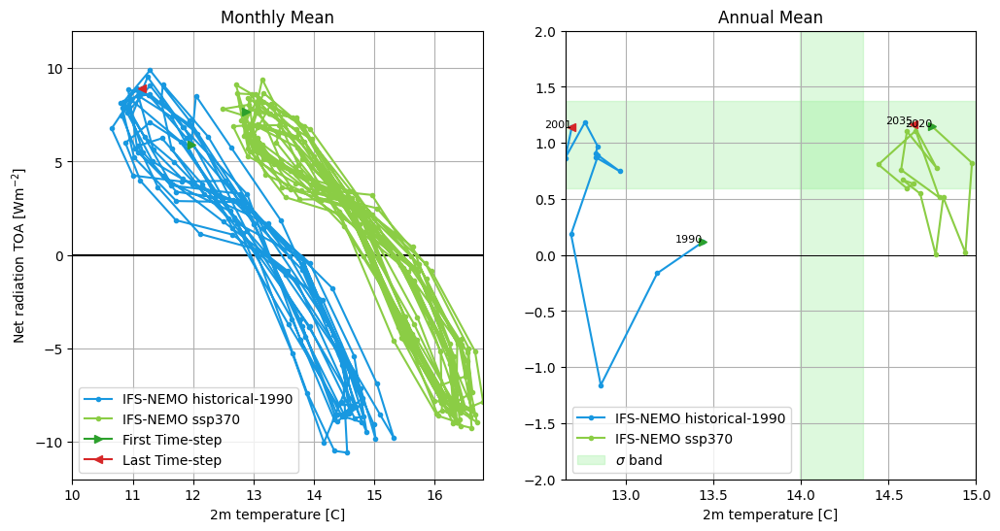
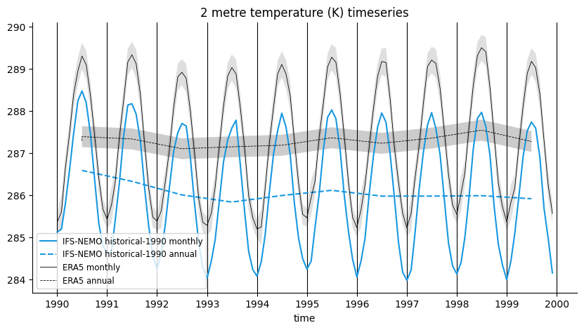
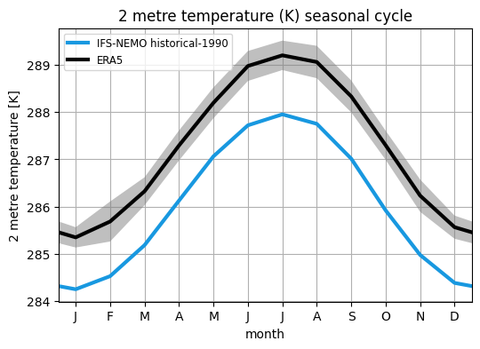

.. _global_timeseries:

Global time series
==================

Description
-----------

The diagnostic is composed of three main functionalities that are implemented as three classes:

* **Timeseries**: a class that computes the global mean time series of a given variable or formula for a given model or list of models. Comparison with a reference dataset is also possible.
* **GregoryPlot**: a class that computes the Gregory-like plot for a given model or list of models. Comparison with a reference dataset is also possible.
* **SeasonalCycle**: a class that computes the seasonal cycle of a given variable or formula for a given model or list of models. Comparison with a reference dataset is also possible.

Structure
-----------

* ``README.md``: a readme file which contains some technical information on how to install the diagnostic and its environment.
* ``pyproject.toml``: a configuration file for the project. This is inteded to be used when installing the AQUA environment.
* ``global_time_series``: a subdirectory which contains the diagnostic source code. Each class is implemented in a separate file.
* ``notebooks``: a subdirectory which contains Jupyter notebooks that demonstrate the diagnostic functionalities.
* ``cli``: a subdirectory which contains the command line interface for the diagnostic.

Input variables
---------------

The diagnostic requires the variables that the user wants to analyse.
For the Gregory-like plot, the following variables are required:

* ``2t`` (2 metre temperature, GRIB paramid 167)
* ``mtnlwrf`` (Mean top net long-wave radiation flux, GRIB paramid 235040)
* ``mtnswrf`` (Mean top net short-wave radiation flux, GRIB paramid 235039)

Basic usage
-----------

The basic usage of each class is explained with a working example in the notebooks provided in the ``notebooks`` directory.
The basic structure of the analysis is the following:

.. code-block:: python

    from global_time_series import Timeseries

    # Define the models to analyse
    models = ['IFS-NEMO', 'ICON']
    exps = ['historical-1990', 'ssp370']
    sources = ['lra-r100-monthly', 'lra-r100-monthly']

    ts = Timeseries(var='2t', models=models, exps=exps, sources=sources,
                    startdate='1990-01-01', enddate='1999-12-31',
                    std_startdate='1990-01-01', std_enddate='1999-12-31',
                    loglevel='INFO')
    ts.run()

The same structure can be used for the other classes.
As can be seen, more than one model can be analysed at the same time.
The user can also define the start and end date of the analysis and the reference dataset.

.. note::

    A ``catalogs`` argument can be passed to the class to define the catalogs to use for the analysis.
    If not provided, the ``Reader`` will identify the catalogs to use based on the models, experiments and sources provided.

CLI usage
---------

The diagnostic can be run from the command line interface (CLI) by running the following command:

.. code-block:: bash

    cd $AQUA/diagnostics/global_time_series/cli
    python cli_global_time_series.py --config_file <path_to_config_file>

Three configuration files are provided and run when executing the aqua-analysis (see :ref:`aqua_analysis`).
Two configuration files are for atmospheric and oceanic timeseries and gregory plots, and the third one is for the seasonal cycles.

Additionally the CLI can be run with the following optional arguments:

- ``--config``, ``-c``: Path to the configuration file.
- ``--nworkers``, ``-n``: Number of workers to use for parallel processing.
- ``--loglevel``, ``-l``: Logging level. Default is ``WARNING``.
- ``--catalog``: Catalog to use for the analysis. It can be defined in the config file.
- ``--model``: Model to analyse. It can be defined in the config file.
- ``--exp``: Experiment to analyse. It can be defined in the config file.
- ``--source``: Source to analyse. It can be defined in the config file.
- ``--outputdir``: Output directory for the plots.

Config file structure
^^^^^^^^^^^^^^^^^^^^^

The configuration file is a YAML file that contains the following information:

* ``models``: a list of models to analyse (defined by the catalog, model, exp, source arguments)
* ``outputdir``: the directory where the output files will be saved
* ``timeseries``: a list of variables to compute the global mean time series
* ``timeseries_formulae``: a list of formulae to compute the global mean time series
* ``gregory``: a block that contains the variables required for the Gregory plot
* ``seasonal_cycle``: a list of variables to compute the seasonal cycle

The ``gregory`` block enables the plot and controls the details of the Gregory plot:

* ``ts``: the variable name to compute the 2 metre temperature.
* ``toa``: the list of variables to compute the Net radiation TOA. It will sum the variables in the list.
* ``monthly``: a boolean that enables the monthly Gregory plot.
* ``annual``: a boolean that enables the annual Gregory plot.
* ``ref``: a boolean that enables the reference dataset for the Gregory plot. At the moment the dataset is ERA5 for 2t and CERES for the Net radiation TOA.
* ``regrid``: if set to a value compatible with the AQUA Reader, the data will be regridded to the specified resolution.
* ``ts_std_start``, ``ts_std_end``: the start and end date for the standard deviation calculation of 2t.
* ``toa_std_start``, ``toa_std_end``: the start and end date for the standard deviation calculation of the Net radiation TOA.

For the other classes, the configuration is done in a block called ``timeseries_plot_params``.
The block contains a default configuration, that can be used for all the variables, and a specific configuration for each variable.
If a block with a specific variable name is found, the default configuration is overwritten by the specific one.

The ``timeseries_plot_params`` block contains the following parameters:

* ``plot_ref``: a boolean that enables the reference dataset for the plot.
* ``plot_ref_kw``: a dictionary with ``{'model': 'ERA5', 'exp': 'era5', 'source': 'monthly'}`` to define the reference dataset.
* ``monthly``: a boolean that enables the monthly time series plot.
* ``monthly_std``: a boolean that enables the monthly standard deviation bands.
* ``annual``: a boolean that enables the annual time series plot.
* ``annual_std``: a boolean that enables the annual standard deviation bands.
* ``regrid``: if set to a value compatible with the AQUA Reader, the data will be regridded to the specified resolution.
* ``startdate``, ``enddate``: the start and end date for the time series plot.
* ``std_startdate``, ``std_enddate``: the start and end date for the standard deviation calculation.
* ``extend``: a boolean that enables the extension of the time series of the reference dataset to match the model time series length. Default is True.
* ``longname``: the long name of the variable. Used to overwrite formulae names.
* ``units``: the units of the variable. Used to overwrite formulae units.

Advanced usage
--------------

Area selection
^^^^^^^^^^^^^^

The diagnostic can be run for a specific area by defining the longitude and latitude bounds while initialising the class.
The area selection can be done for the Timeseries and SeasonalCycle classes.

.. code-block:: python

    ts = Timeseries(var='2t', models=models, exps=exps, sources=sources,
                    startdate='1990-01-01', enddate='1999-12-31',
                    std_startdate='1990-01-01', std_enddate='1999-12-31',
                    lat_limits=[-90, 0], loglevel='INFO')
    ts.run()

Title, caption and filenames will be updated with the area selection informations.

.. note::

    The area selection is not available for the CLI yet.

Output
------

The diagnostic produces three types of plots (see :ref:`global_timeseries_examples`):

* A comparison of monthly and/or annual global mean time series of the model and the reference dataset.
* A comparison of the seasonal cycle of the model and the reference dataset.
* A Gregory-like plot of the model and the reference dataset as bands.

The timeseries, reference timeseries and standard deviation timeseries are saved in the output directory as netCDF files.

Observations
------------

The diagnostic uses the following reference datasets:

* ERA5 as a default reference dataset for the global mean time series and seasonal cycle.
* ERA5 for the 2m temperature and CERES for the Net radiation TOA in the Gregory-like plot.

Custom reference datasets can be used.

.. _global_timeseries_examples:

Example Plots
-------------

A plot for each class is shown below.
All these plots can be produced by running the notebooks in the ``notebooks`` directory on LUMI HPC.

    Gregory plot of IFS-NEMO historical-1990 and ssp370 simulations.
    The left panel represents the monthly Gregory plot, while on the right the annual Gregory plot is shown.
    The start and end point of the Gregory plot are indicated by the green and red arrows, respectively.
    In the annual Gregory plot a band representing the 2 sigma confidence interval is shown in green.
    This is evaluated with ERA5 data (1980-2010) for the 2m temperature and with CERES data (2000-2020) for the Net radiation TOA.

    Global mean temperature time series of IFS-NEMO historical-1990 and comparison with ERA5.
    Both monthly and annual timeseries are shown. A 2 sigma confidence interval is evaluated for ERA5 data (1990-2020).

    Seasonal cycle of the global mean temperature of IFS-NEMO historical-1990 and comparison with ERA5.
    The 2 sigma confidence interval is evaluated for ERA5 data (1990-2020).

Available demo notebooks
------------------------

Notebooks are stored in diagnostics/global_time_series/notebooks

* `global_time_series.ipynb <https://github.com/oloapinivad/DestinE-Climate-DT/blob/main/diagnostics/global_time_series/notebooks/global_time_series.ipynb>`_
* `seasonal_cycles.ipynb <https://github.com/oloapinivad/DestinE-Climate-DT/blob/main/diagnostics/global_time_series/notebooks/seasonal_cycles.ipynb>`_

Detailed API
------------

This section provides a detailed reference for the Application Programming Interface (API) of the ``global_time_series`` diagnostic,
produced from the diagnostic function docstrings.

.. automodule:: global_time_series
    :members:
    :undoc-members:
    :show-inheritance:
