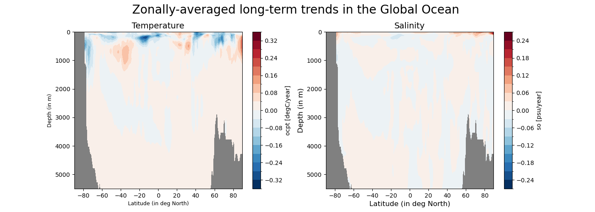
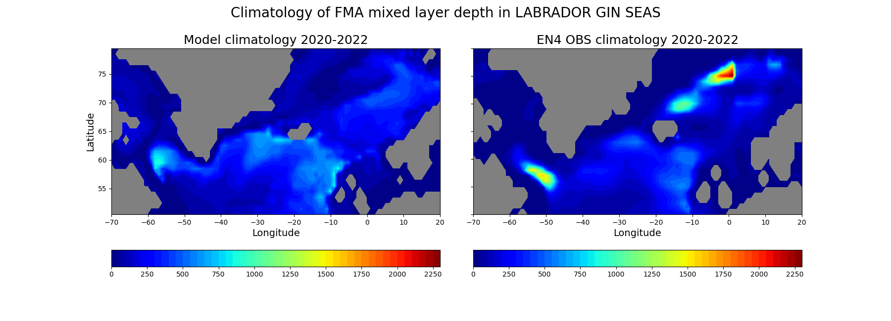

Ocean3D
================

Description
-----------

This package contains two submodules to monitor and evaluate the 3D ocean evolution and mean state:

`Ocean Drifts` to characterise and monitor model drifts 
`Ocean Circulation` to evaluate the realism of the model in simulating key precursors of the ocean circulation

All these diagnostics are produced in a consistent way, for a selected model simulation.

Structure
-----------

The ocean3d diagnostic follows a class structure and consists of the files:

* `ocean_drifts.py`: a python file that contains the functions that are specific for the computation of the ocean drift diagnostics;
* `ocean_circulation.py`: a python file that contains the functions that are specific for the computation of the ocean circulation diagnostics;
* `ocean_utils.py`: a python file that contains functions that are used in both ocean3d diagnostic modules; 
* `notebooks/ocean_drifts.ipynb`: an ipython notebook with examples on how to apply the ocean drift diagnostics;
* `notebooks/ocean_circulation.ipynb`: an ipython notebook with examples on how to apply the ocean circulation diagnostics;
* `README.md` : a readme file which contains some tecnical information on how to install the ocean3d diagnostic and its environment. 

Input variables example
------------------------

* ocpt (Ocean potential temperature, GRIB paramid 150129)
* so     (Sea water practical salinity, GRIB paramid 151130)

Output 
------

This module exports all the data and diagnostics  used to create the different figures.
  

Functions used 
---------------

hovmoller_lev_time_plot
^^^^^^^^^^^^^^^^^^^^^

.. code-block:: python

    hovmoller_lev_time_plot(data, region, anomaly: bool = False, standardise: bool = False, anomaly_ref=None,
                            latS: float = None, latN: float = None, lonW: float = None, lonE: float = None,
                            output: bool = False, output_dir: str = None)

This function generates a Hovmoller plot of regionally averaged temperature and salinity data with customizable data processing and plot configuration.

Parameters:
    - data (DataArray): Input data containing temperature and salinity values.
    - region (str): Name of the region for plotting. Supports all major oceans and seas. Custom regions can be defined using latitude and longitude values.
    - anomaly (bool): Whether to compute anomalies. Default is False.
    - standardise (bool): Whether to standardize anomalies. Default is False.
    - anomaly_ref (Optional): Reference time to compute anomalies. Required if `anomaly` is True.
    - latS (float): Southern latitude boundary for custom region. Default is None.
    - latN (float): Northern latitude boundary for custom region. Default is None.
    - lonW (float): Western longitude boundary for custom region. Default is None.
    - lonE (float): Eastern longitude boundary for custom region. Default is None.
    - output (bool): Whether to save the plot and data. Default is False.
    - output_dir (str): Directory to save the output files. Default is None.

Returns:
    None

Notes:
    - The function generates a Hovmoller plot, which is a 2D representation of regionally averaged temperature and salinity values.
    - The plot configuration and data processing can be customized using the function parameters.
    - Supported region names include all major oceans and seas. Users can also define custom regions using latitude and longitude values.

Examples:
    >>> hovmoller_lev_time_plot(data, region="Pacific Ocean", anomaly=True, standardise=True, anomaly_ref= "t0")
    This example generates a Hovmoller plot for the Pacific Ocean region, computing anomalies and standardizing the data using a reference initial time.

    >>> hovmoller_lev_time_plot(data, region="Custom Region", anomaly=True, anomaly_ref= "tmean", latS=-30, latN=30, lonW=-180, lonE=180)
    This example generates a Hovmoller plot for a custom region defined by the latitude (-30 to 30) and longitude (-180 to 180) boundaries, computing anomalies using a reference time mean.

time_series_multilevs
^^^^^^^^^^^^^^^^^^^^^

.. code-block:: python

    time_series_multilevs(data, region=None, anomaly: bool = False, standardise: bool = False, anomaly_ref=None,
                          customise_level=False, levels: list =None,
                          latS: float = None, latN: float = None, lonW: float = None, lonE: float = None,
                          output: bool = True, output_dir: str = None)

This function generates time series plots of regionally averaged temperature and salinity data with customizable data processing and plot configuration for predefined or customized list of vertical levels.

Parameters:
    - data (DataArray): Input data containing temperature and salinity values.
    - region (str): Name of the region for plotting. Supports major oceans and seas. Custom regions can be defined using latitude and longitude values. Default is None.
    - anomaly (bool): Whether to compute anomalies. Default is False.
    - standardise (bool): Whether to standardize anomalies. Default is False.
    - anomaly_ref (Optional): Reference time to compute anomalies. Required if `anomaly` is True.
    - customise_level (bool): Whether to use a custom list of vertical levels. Default is False.
    - levels (list): List of vertical levels to plot. Ignored if `customise_level` is False.
    - latS (float): Southern latitude boundary for custom region. Required if `region` is None.
    - latN (float): Northern latitude boundary for custom region. Required if `region` is None.
    - lonW (float): Western longitude boundary for custom region. Required if `region` is None.
    - lonE (float): Eastern longitude boundary for custom region. Required if `region` is None.
    - output (bool): Whether to save the plot and data. Default is True.
    - output_dir (str): Directory to save the output files. Default is None.

Returns:
    None

Notes:
    - The function generates time series plots of regionally averaged temperature and salinity values.
    - The plot configuration and data processing can be customized using the function parameters.
    - Supported region names include major oceans and seas. Custom regions can be defined by specifying latitude and longitude boundaries.
    - If the `region` parameter is set to None, the `latS`, `latN`, `lonW`, and `lonE` parameters are required to define a custom region.

Examples:
    >>> time_series_multilevs(data, region="Pacific Ocean", anomaly=True, standardise=True, anomaly_ref= "t0")
    This example generates time series plots for the Pacific Ocean region, computing standardized anomalies using a reference to the initial time.

    >>> time_series_multilevs(data, region=None, customise_level=True, levels=[0, 200, 1000])
    This example generates time series plots for a custom region using a custom list of vertical levels, including 0m, 200m, and 1000m.

multilevel_t_s_trend_plot
^^^^^^^^^^^^^^^^^^^^^^^^

.. code-block:: python

    multilevel_t_s_trend_plot(data, region=None, customise_level=False, levels: list =None,
                              latS: float = None, latN: float = None, lonW: float = None,lonE: float = None,
                              output: bool = True, output_dir: str = None)

This function generates lon-lat maps of linear temporal trends of temperature and salinity data over a selected region with customizable depth levels.

Parameters:
    - data (DataArray): Input data containing temperature and salinity values.
    - region (str): Name of the region for plotting. Supports all major oceans and seas. Custom regions can be defined using latitude and longitude values. Default is None.
    - customise_level (bool): Whether to use a custom list of vertical levels. Default is False.
    - levels (list): List of vertical levels to plot. Ignored if `customise_level` is False.
    - latS (float): Southern latitude boundary for custom region. Required if `region` is None. Default is None.
    - latN (float): Northern latitude boundary for custom region. Required if `region` is None. Default is None.
    - lonW (float): Western longitude boundary for custom region. Required if `region` is None. Default is None.
    - lonE (float): Eastern longitude boundary for custom region. Required if `region` is None. Default is None.
    - output (bool): Whether to save the plot and data. Default is True.
    - output_dir (str): Directory to save the output files. Default is None.

Returns:
    None

Notes:
    - The function generates lon-lat maps of linear temporal trends of temperature and salinity data.
    - The plot configuration and depth levels can be customized using the function parameters.
    - Supported region names include all major oceans and seas. Users can also define custom regions using latitude and longitude values.
    - If the `region` parameter is set to None, the `latS`, `latN`, `lonW`, and `lonE` parameters are required to define a custom region.

Examples:
    >>> multilevel_t_s_trend_plot(data, region="Pacific Ocean", customise_level=True, levels=[0, 200, 1000])
    This example generates lon-lat maps of linear temporal trends of temperature and salinity for the Pacific Ocean region at specified depth levels of 0m, 200m, and 1000m.

    >>> multilevel_t_s_trend_plot(data, region=None, latS=-30, latN=30, lonW=-180, lonE=180)
    This example generates lon-lat maps of linear temporal trends of temperature and salinity for a custom region defined by the latitude (-30 to 30) and longitude (-180 to 180) boundaries.

zonal_mean_trend_plot
^^^^^^^^^^^^^^^^^^^^^^^^

.. code-block:: python

    zonal_mean_trend_plot(data, region=None, latS: float = None, latN: float = None, lonW: float = None, lonE: float = None,
                          output: bool = True, output_dir: str = None)

This function generates plots of zonally averaged linear temporal trends of temperature and salinity data as a function of depth and latitude over a selected region.

Parameters:
    - data (DataArray): Input data containing temperature and salinity values.
    - region (str): Name of the region for plotting. Supports all major oceans and seas. Custom regions can be defined using latitude and longitude values. Default is None.
    - latS (float): Southern latitude boundary for custom region. Required if `region` is None. Default is None.
    - latN (float): Northern latitude boundary for custom region. Required if `region` is None. Default is None.
    - lonW (float): Western longitude boundary for custom region. Required if `region` is None. Default is None.
    - lonE (float): Eastern longitude boundary for custom region. Required if `region` is None. Default is None.
    - output (bool): Whether to save the plot and data. Default is True.
    - output_dir (str): Directory to save the output files. Default is None.

Returns:
    None

Notes:
    - The function generates plots of zonally averaged linear temporal trends of temperature and salinity data.
    - The zonal average is calculated over the selected region, which supports all major oceans and seas. Custom regions can be defined using latitude and longitude values.
    - The plot shows the variation of temperature and salinity trends with depth and latitude.

Examples:
    >>> zonal_mean_trend_plot(data, region="Pacific Ocean", latS=-30, latN=30)
    This example generates plots of zonally averaged linear temporal trends of temperature and salinity for the Pacific Ocean region, limited to latitudes between -30 and 30 degrees.

    >>> zonal_mean_trend_plot(data, region=None, latS=-60, latN=60, lonW=-180, lonE=180)
    This example generates plots of zonally averaged linear temporal trends of temperature and salinity for a custom region defined by the latitude (-60 to 60) and longitude (-180 to 180) boundaries.

plot_stratification
^^^^^^^^^^^^^^^^^^^^^^^^

.. code-block:: python

    plot_stratification(mod_data, region=None, time=None, latS: float = None, latN: float = None, lonW: float = None, lonE: float = None,
                        output: bool = True, output_dir: str = None)

This function generates a stratification plot of temperature, salinity, and density data, including overlapped data with observations, over a selected region and time period.

Parameters:
    - mod_data (DataArray): Model data containing temperature, salinity, and density values.
    - region (str): Name of the region for plotting. Supports all major oceans and seas. Custom regions can be defined using latitude and longitude values. Default is None.
    - time (datetime): Time of the climatology for plotting. Default is None.
    - latS (float): Southern latitude boundary for custom region. Required if `region` is None. Default is None.
    - latN (float): Northern latitude boundary for custom region. Required if `region` is None. Default is None.
    - lonW (float): Western longitude boundary for custom region. Required if `region` is None. Default is None.
    - lonE (float): Eastern longitude boundary for custom region. Required if `region` is None. Default is None.
    - output (bool): Whether to save the plot and data. Default is True.
    - output_dir (str): Directory to save the output files. Default is None.

Returns:
    None

Notes:
    - The function generates a stratification plot showing the vertical profiles of temperature, salinity, and density data.
    - The plot includes overlapped data with observations for comparison.
    - Supported region names include all major oceans and seas. Users can also define custom regions using latitude and longitude values.
    - The time parameter specifies the climatology time for plotting.

Examples:
    >>> plot_stratification(mod_data, region="Pacific Ocean", time= "Feb", latS=-30, latN=30)
    This example generates a stratification plot of temperature, salinity, and density data for the Pacific Ocean region for the climatology time of February, limited to latitudes between -30 and 30 degrees.

    >>> plot_stratification(mod_data, region=None, time= "JJA", latS=-60, latN=60, lonW=-180, lonE=180)
    This example generates a stratification plot of temperature, salinity, and density data for a custom region defined by the latitude (-60 to 60) and longitude (-180 to 180) boundaries for the climatology time of January, July, and August.

plot_spatial_mld_clim
^^^^^^^^^^^^^^^^^^^^^^^^

.. code-block:: python

    plot_spatial_mld_clim(mod_data, region=None, time=None, latS: float = None, latN: float = None, lonW: float = None, lonE: float = None,
                          overlap: bool = False, output: bool = False, output_dir: str = None)

This function generates a time series plot of temperature and salinity data, specifically focusing on the Mixed Layer Depth (MLD), for a selected region and time period. Users can choose to use the whole observation data or overlapped observation data with the model.

Parameters:
    - mod_data (DataArray): Model data containing temperature and salinity values.
    - region (str): Name of the region for plotting. Supports all major oceans and seas. Custom regions can be defined using latitude and longitude values. Default is None.
    - time (datetime): Time of the climatology for plotting. Default is None.
    - latS (float): Southern latitude boundary for custom region. Default is None.
    - latN (float): Northern latitude boundary for custom region. Default is None.
    - lonW (float): Western longitude boundary for custom region. Default is None.
    - lonE (float): Eastern longitude boundary for custom region. Default is None.
    - overlap (bool): Whether to use overlapped observation data with the model. Default is False.
    - output (bool): Whether to save the plot and data. Default is False.
    - output_dir (str): Directory to save the output files. Default is None.

Returns:
    None

Notes:
    - The function generates a time series plot of temperature and salinity data, specifically focusing on the Mixed Layer Depth (MLD).
    - Users can choose whether to use the whole observation data or overlapped observation data with the model.
    - Supported region names include all major oceans and seas. Users can also define custom regions using latitude and longitude values.
    - The time parameter specifies the climatology time for plotting.

Examples:
    >>> plot_spatial_mld_clim(mod_data, region="Pacific Ocean", time= "Feb", overlap=True, latS=-30, latN=30)
    This example generates a time series plot of temperature and salinity data, focusing on the Mixed Layer Depth (MLD), for the Pacific Ocean region for the climatology time of February, using overlapped observation data with the model, and limited to latitudes between -30 and 30 degrees.

    >>> plot_spatial_mld_clim(mod_data, region=None, time= "JJA", overlap=False, latS=-60, latN=60, lonW=-180, lonE=180)
    This example generates a time series plot of temperature and salinity data, focusing on the Mixed Layer Depth (MLD), for a custom region defined by the latitude (-60 to 60) and longitude (-180 to 180) boundaries for the climatology time of January, July, and August., using the whole observation data.

Methods used 
---------------
All regional averages have been produced with area weights.

Temporal trends are computed as linear trends and estimated over the whole temporal span of the dataset.

The mixed layer depth is computed by the function `compute_mld_cont` from sigma0 monthly fields following the criteria from de Boyer Montegut et al (2004)

Density fields are computed from absolute salinity and conservative temperature fields using the TEOS-10 equations. Absolute salinity and conservative temperature are also computed from practical salinity and potential temperature fields with TEOS-10 equations.

Observations  
---------------

EN4.2.2.g10 ocpt and so observations for the period 1950-2022

.. This set of diagnostics has been developed to monitor potential drifts and initialization shock in the models.
.. Observations do not provide any added value for the identification of the drift and were not considered.

References
----------
de Boyer Montégut, C., Madec, G., Fischer, A. S., Lazar, A., and Iudicone, D. (2004): Mixed layer depth over the global ocean: An examination of profile data and a profile-based climatology. J. Geophys. Res., 109, C12003, doi:10.1029/2004JC002378

Gouretski and Reseghetti (2010): On depth and temperature biases in bathythermograph data: development of a new correction scheme based on analysis of a global ocean database. Deep-Sea Research I, 57, 6. doi: http://dx.doi.org/10.1016/j.dsr.2010.03.011

https://www.teos-10.org/

A code to compute very efficiently the linear trends has been adapted from this website:
https://stackoverflow.com/questions/52108417/how-to-apply-linear-regression-to-every-pixel-in-a-large-multi-dimensional-array

Example Plot(s)
---------------

* This is an example of one of the hovmöller T, S figures

.. figure:: figures/ocean3d1.png
    :width: 18cm

* This is an example of the multipanel plots of the spatially averaged T, S timeseries at different levels

.. figure:: figures/ocean3d2.png
    :width: 18cm

* This is an example of the multi-panel plots of lat-lon  maps of temporal trends in T, S at different levels

.. figure:: figures/ocean3d3.png
    :width: 18cm

* This is an example of the plots of lat-depth maps of temporal trends in T, S

* This is an example of one of the climatological stratification profiles.

.. figure:: figures/ocean3d5.png
    :width: 20cm

* This is an example of one of the mixed-layer depth climatologies.

Available demo notebooks
------------------------

Notebooks are stored in diagnostics/ocean3d/notebooks

* `global_ocean.ipynb <https://github.com/oloapinivad/AQUA/blob/main/diagnostics/ocean3d/notebooks/ocean_drifts.ipynb>`_

    
* `ocean_circulation.ipynb <https://github.com/oloapinivad/AQUA/blob/main/diagnostics/ocean3d/notebooks/ocean_circulation.ipynb>`_
    
Detailed API
------------

This section provides a detailed reference for the Application Programming Interface (API) of the "ocean3d" diagnostic,
produced from the diagnostic function docstrings.

.. automodule:: ocean3d
    :members:
    :undoc-members:
    :show-inheritance:
