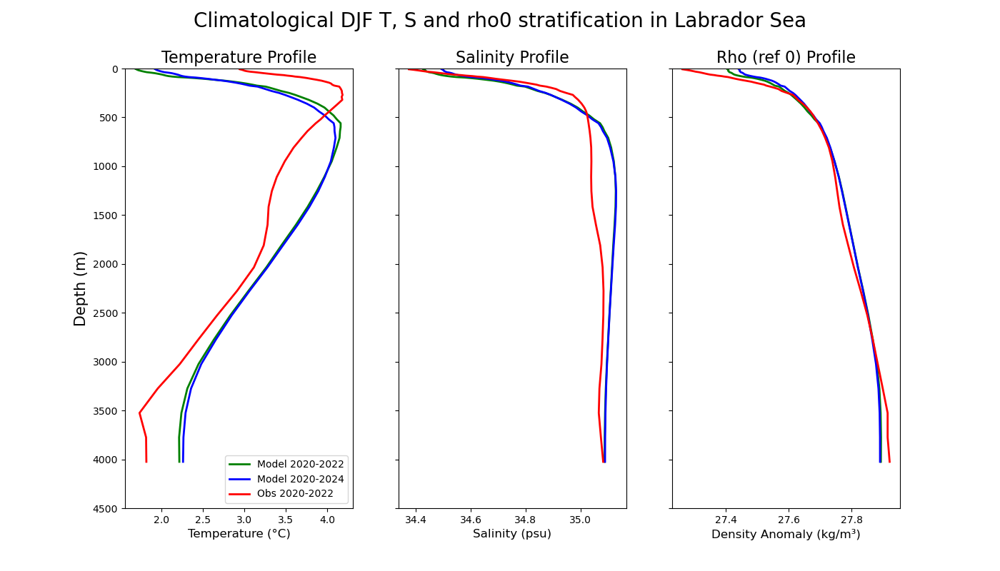

Ocean Circulation
=================

Description
-----------

This package provides a set of diagnostics associated with the Ocean Circulation which in the current release include 
climatological stratification profiles in regions of deep water formation and climatologies for the mixed layer depth.

All these diagnostics are produced in a consistent way both for a selected model simulation and EN4 observations 

Structure
---------

The ocean_circulation diagnostic follows a class structure and consists of the files:

* `ocean_circulation.py`: a python file which contains functions that are called and used in the ocean_circulation class;
* `config.yml`: a yaml file with the required dependencies for the ocean_circulation diagnostic;
* `notebooks/ocean_circulation.ipynb`: an ipython notebook which uses the dymmy class and its methods;
* `README.md` : a readme file which contains some tecnical information on how to install the ocean_circulation diagnostic and its environment. 

Input variables example
------------------------

* `ocpt` (Ocean potential temperature, GRIB paramid 150129)
* `so`   (Sea water practical salinity, GRIB paramid 151130)

Output 
------

Climatologies of the Mixed Layer Depth for both the model and observations in NetCDF format

Climatologies of ocpt, so and sigma0 (potential density referenced at the surface) spatially averaged for any region of interest

Functions used 
--------------
Stratification plot: This function requires data, a region, and the time of the climatology. And it produces a stratification plot of Temperature, salinity and Density, including the overlapped data with the observation. The region name supports all the major oceans and seas, in case users require a custom region, they can fill in the values of latitude, and longitude in the boxes.

.. code-block:: python

    plot_stratification(data, region= "Labrador Sea", time = "February",latS, latN, lonE, lonW, output= True, output_dir="./output")

Mixed Layer Depth Plot: This function requires data, a region, and the time of the climatology. And it produces a time series plot of Temperature and salinity. Users ahve the option of choosing whether they want to use the whole obs data or overlapped obs data with the model. The region name supports all the major oceans and seas; in case users require a custom region, they can fill in the values of latitude, and longitude in the boxes.

.. code-block:: python

    plot_spatial_mld_clim(data, region= "labrador_gin_seas", time = "MAR", overlap= True,output= True, output_dir="./output")

Methods used
------------

The mixed layer depth is computed by the function `compute_mld_cont` from sigma0 monthly fields following the criteria from de Boyer Montegut et al (2004)

Density fields are computed from absolute salinity and conservative temperature fields using the TEOS-10 equations. Absolute salinity and conservative temperature are also computed from practical salinity and potential temperature fields with TEOS-10 equations.

Observations
------------

EN4.2.2.g10 ocpt and so observations for the period 1950-2022

References
----------
de Boyer Montégut, C., Madec, G., Fischer, A. S., Lazar, A., and Iudicone, D. (2004): Mixed layer depth over the global ocean: An examination of profile data and a profile-based climatology. J. Geophys. Res., 109, C12003, doi:10.1029/2004JC002378

Gouretski and Reseghetti (2010): On depth and temperature biases in bathythermograph data: development of a new correction scheme based on analysis of a global ocean database. Deep-Sea Research I, 57, 6. doi: http://dx.doi.org/10.1016/j.dsr.2010.03.011

https://www.teos-10.org/

Example Plot(s)
---------------

    This is an example of one of the climatological stratification profiles. 

.. figure:: figures/ocean_circulation2.png
    :width: 20cm

    This is an example of one of the mixed layer depth climatologies. 

Available demo notebooks
------------------------

A notebook with examples on how to call the diagnostic functions can be found in diagnostics/ocean_circulation-diagnostic/notebooks

* `ocean_circulation.ipynb <https://github.com/oloapinivad/AQUA/blob/devel/ocean_circulation/diagnostics/ocean_circulation/notebooks/ocean_circulation.ipynb>`_
        
Detailed API
------------

This section provides a detailed reference for the Application Programming Interface (API) of the "ocean_circulation" diagnostic,
produced from the diagnostic function docstrings.

.. automodule:: ocean_circulation
    :members:
    :undoc-members:
    :show-inheritance:
