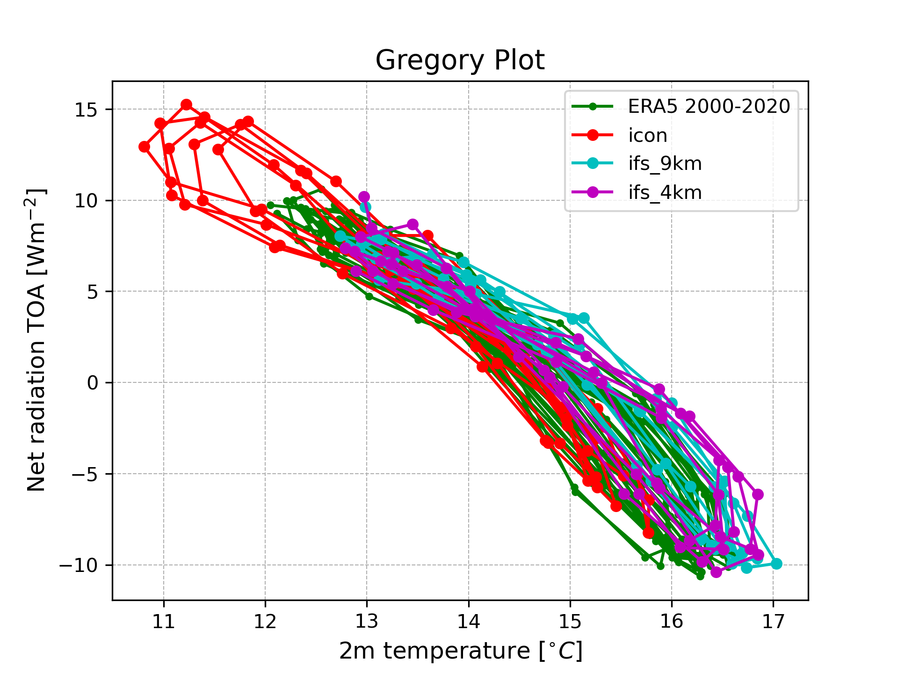
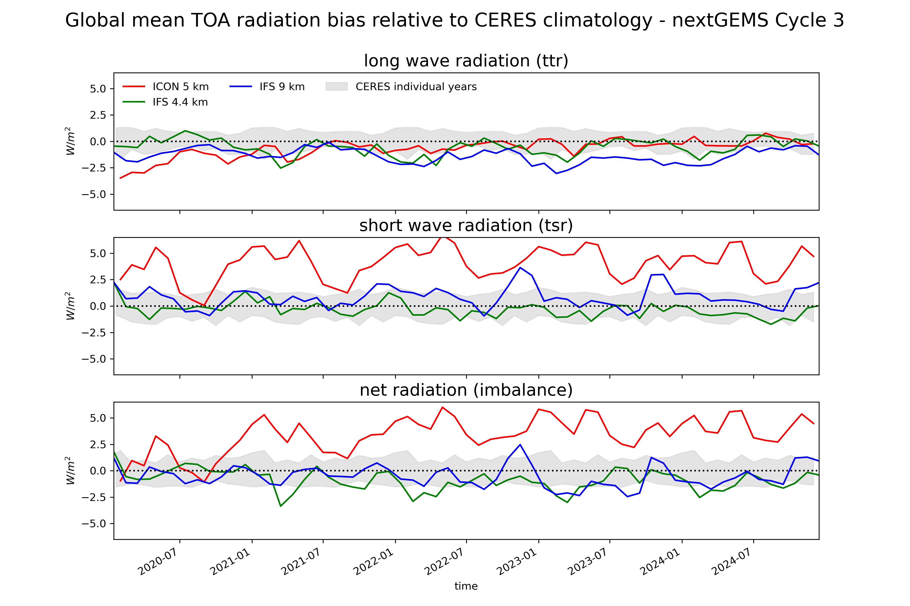
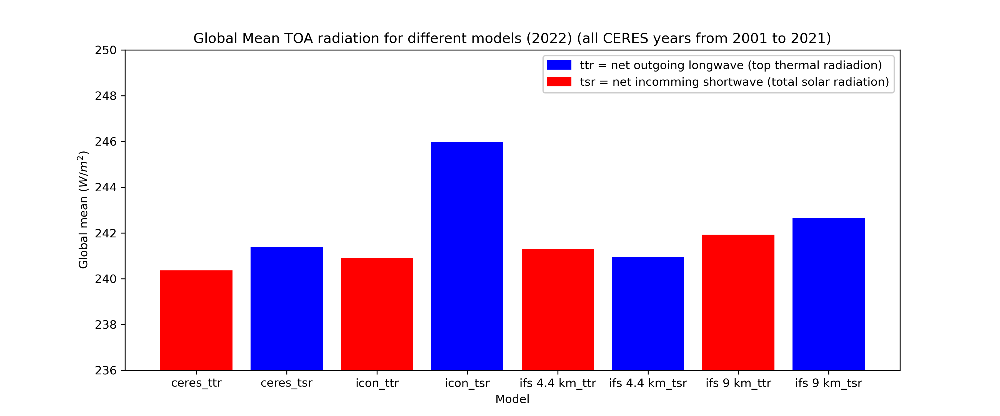

Radiation Budget Diagnostic
=============================

Description
-----------

This package provides a diagnostic for assessing the model radiative budget imbalances at the top of atmosphere (TOA) (surface to be added). It aims to detect potential biases in the models. The diagnostic includes various plots, such as Gregory plots, to provide insights into lingering model drifts or general biases in the radiation budget. The data this diagnostic uses are nextGEMS cycle 2 and nextGEMS cycle 3 data. Additionally, data for comparison is needed: satellite data from the CERES Energy Balanced and Filled (CERES-EBAF catalogue) and reanalysis (ERA5) is used. The file `functions.py` contains all the functions to load, process and plot the model and observation data.

Structure
---------

*  `README.md`: a readme file which contains some technical information on how to install the diagnostic and its environment;
*  `functions.py`: a python file in which the functions are implemented;
*  `time_series.ipynb`: a notebook that shows how the output of the `plot_model_comparison_timeseries` function;
*  `gregory.ipynb`: a notebook that demonstrates how to produce gregory plots of desired models;
*  `bar_plot.ipynb`: a notebook that demonstrates how to create bar plots;
*  `bias_maps.ipynb`: a notebook that creates bias maps to localise significant biases in comparison to CERES data. 

Input variables 
---------------

*  `ttr` (total thermal radiadion): longwave radiation;
*  `tsr` (total solar radiation): shortwave radiation;
*  `tnr` (total net radiation): net radiation;
*  `2t` (2 meter temperature): only used for the Gregory plots.

The data we retrieve through the provided functions have monthly timesteps and a 1x1 deg resolution. A higher resolution is not necessary for this diagnostic.

Output
------

This diagnostic produces figures that are saved in a PDF file and NetCDF data per function used.

Functions used 
---------------

In the following, we report a usage example which illustrates how to load the data. Since this diagnostic aims to inform about model stability, a high resolution is not necessary. Instead monthly data with a regular 1 x 1 grid is used. This data can be retrieved and processed from the Low Resolution Archive (LRA), that is part of the AQUA framework. 
Example on how to load the datasets (e.g. IFS Cycle 3 4.4 km data) from the LRA:

.. code-block:: python

    TOA_ifs_4km_gm, reader_ifs_4km, data_ifs_4km, TOA_ifs_4km, TOA_ifs_4km_r360x180 = radiation_diag.process_model_data(model =  'IFS' , exp = 'tco2559-ng5-cycle3' , source = 'lra-r100-monthly')
    
The returned data contain:

*  `TOA_ifs_4km_gm`: global means of the data;
*  `reader_ifs_4km`: AQUA reader, that could also be retrieved via: 'reader = Reader(model=model,exp=exp,source=source)';
*  `data_ifs_4km`: returned xarray-dataset, that contains all the variables;
*  `TOA_ifs_4km`: returned xarray-dataset, that contains the necessary variables for analysis.

Other available functions:
*  `process_ceres_data`: extracts CERES data for further analysis and creates global means;
*  `process_model_data`: extracts model output data for further analysis and creates global means;
*  `process_era5_data`: extracts ERA5 data for further analysis;
*  `gregory_plot`: creates a Gregory Plot with various models and ERA5 data;
*  `barplot_model_data`: creates a bar plot with various models and CERES data;
*  `plot_maps`: creates monthly bias maps of various models to show the bias wrt CERES data;
*  `plot_model_comparison_timeseries`: creates a time series and visualizes the variability of the values wrt CERES years.

Observation
-----------

The radiation data are compared to CERES data and ERA5 (used for creating Gregory plots due to the missing 2t variable in the CERES dataset)

References
----------

* https://github.com/nextGEMS/nextGEMS_Cycle3/blob/main/IFS/radiation_evaluation.ipynb

Example plots
-------------

   Gregory Plot of different models and ERA5 data.
   

   Time series of model biases with respect to CERES data.   

   Bar plot to show the radiation imbalances
   
   
Available demo notebooks
------------------------

Notebooks are stored in `diagnostics/radiation/notebooks`:

* `time_series.ipynb`: https://github.com/oloapinivad/AQUA/blob/main/diagnostics/radiation/notebooks/time_series.ipynb
* `gregory.ipynb`: https://github.com/oloapinivad/AQUA/blob/main/diagnostics/radiation/notebooks/gregory.ipynb
* `bar_plot.ipynb`: https://github.com/oloapinivad/AQUA/blob/main/diagnostics/radiation/notebooks/bar_plot.ipynb
* `bias_maps.ipynb`: https://github.com/oloapinivad/AQUA/blob/main/diagnostics/radiation/notebooks/bias_maps.ipynb
   
   
Detailed API
------------
This section provides a detailed reference for the Application Programming Interface (API) of the "radiation" diagnostic, produced from the diagnostic function docstrings.

.. automodule:: radiation
    :members:
    :undoc-members:
    :show-inheritance:
