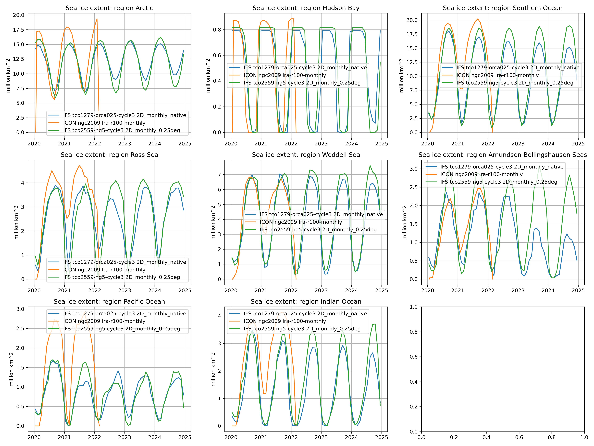

===================
Sea Ice Diagnostics
===================

Sea ice extent
==============

Description
-----------

The sea ice extent (SIE) is defined as the areal integral of all ocean grid cells that contain at least 15% of sea ice concentration (SIC). This threshold-based definition has its drawbacks (it is subjective, it is not as physical as sea ice area, it is not linear under time averaging) but has the advantage to be practical, as it corresponds to the surface enclosed by the sea ice edge.

Further details on the definition can be gound on the National Snow and Ice Data Center (NSIDC) `website <https://nsidc.org/learn/ask-scientist/what-difference-between-sea-ice-area-and-extent#:~:text=Sea%20ice%20area%20is%20the,15%20percent%20sea%20ice%20cover>`_.

As an index resulting from a spatial integral, the same SIE can be obtained from different SIC distributions. Therefore, for model evaluation, it is generally recommended to compute SIE over specific regions to exclude the possibility of error compensations.

Structure
-----------

The sea ice extent diagnostic follows a class structure and consists of the files:

* `seaice_class.py`: a python file in which the SeaIceExtent class constructor and the other class methods are included;
* `regions.yml`: a yaml file with the definitions of regions where SIE can be calculated
* `notebooks/seaice.ipynb`: an ipython notebook which uses the `seaice_class` class and its methods;
* `README.md`: a readme file which contains some technical information on how to install the sea ice diagnostic and its environment. 

Input variables
---------------

* `ci` (sea ice concentration, GRIB paramid 31)
* usual model-specific invariants (latitude, longitude, grid cell areas)

Output 
------

The script produces `figSIE.pdf` and `figSIE.png`,  two figures showing the full seasonal cycles of sea ice extent in the specified regions for the available time of integrations.

Methods used
------------

Examples from the seaIce class contained in the seaice_class.py file:

* "run": method to retrieve the data and  compute the sea ice extent of the retrieved data. 

Observations
------------

OSI-SAF osi-450. See Lavergne et al. (2019)

References
----------

* Lavergne, T., Sørensen, A. M., Kern, S., Tonboe, R., Notz, D., Aaboe, S., Bell, L., Dybkjær, G., Eastwood, S., Gabarro, C., Heygster, G., Killie, M. A., Brandt Kreiner, M., Lavelle, J., Saldo, R., Sandven, S., & Pedersen, L. T. (2019). Version 2 of the EUMETSAT OSI SAF and ESA CCI sea-ice concentration climate data records. The Cryosphere, 13(1), 49–78. https://doi.org/10.5194/tc-13-49-2019

Example Plot(s)
---------------

    An illustration of the big void left by this diagnostic

Available demo notebooks
------------------------

Notebooks are stored in diagnostics/seaice/notebooks

* `seaice.ipynb <https://github.com/oloapinivad/AQUA/blob/develop_seaice/diagnostics/seaice/notebooks/seaice.ipynb>`_
