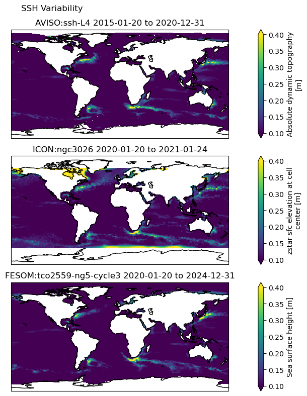

SSH variability
===============
Description
-----------

This application calculates the sea surface height standard deviation for multiple models (e.g. FESOM, ICON, NEMO) and compares them against the AVISO model. It also provides visualization of the SSH variability for the models. SSH variability provides insights into the complex dynamics of the ocean. It represents the changes in sea surface height over time, which can be influenced by various factors such as ocean currents, wind patterns, tides, and interactions with the atmosphere. By studying SSH variability, we can gain a better understanding of oceanic processes and their impact on climate. High-resolution climate models simulate fine-scale variations in SSH, capturing small-scale features and regional differences highly relevant in the context of climate adaptation for instance, coastal management such as managing coastal hazards like flooding or storm surges.

Structure
-----------

The SSH diagnostic follows a class structure and consists of the files:

* `ssh_class.py`: a python file in which the sshVariability class constructor and the other class methods are included;
* `config.yml`: a yaml file with the required user configurations for the SSH diagnostic;
* `notebooks/ssh_example_4outputs.ipynb`: an ipython notebook which uses the ssh_class and its methods;
* `README.md` : a readme file which contains technical information on how to install the SSH diagnostic and its environment. 

input variables
---------------

* `ssh` (Sea Surface Height from different models)

Output 
------

* SSH variability for each input model in NetCDF format. 
* Visualization of SSH Variability via subplots in PDF format.

Observations
------------

AVISO Sea Surface Height Data

Available demo notebooks
------------------------

Notebooks are stored in diagnostics/SSH/notebooks

* `ssh_example_outputs.ipynb <https://github.com/oloapinivad/AQUA/blob/devel/ssh2/diagnostics/ssh/notebooks/ssh_example_outputs.ipynb>`_

References
----------

* Copernicus Climate Change Service, Climate Data Store, (2018): Sea level gridded data from satellite observations for the global ocean from 1993 to present. Copernicus Climate Change Service (C3S) Climate Data Store (CDS). DOI: 10.24381/cds.4c328c78 (Accessed on 01-Mar-2023)

Example Plot(s)
---------------

Detailed API
------------

This section provides a detailed reference for the Application Programming Interface (API) of the "SSH" diagnostic,
produced from the diagnostic function docstrings.

.. automodule:: ssh
    :members:
    :undoc-members:
    :show-inheritance:
