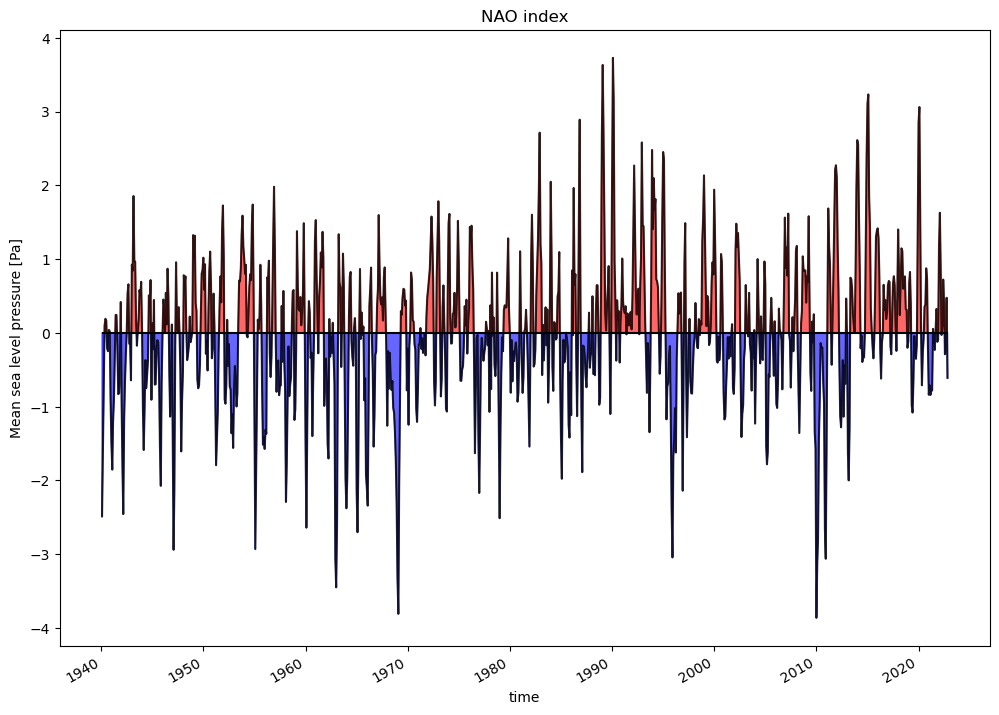

.. _teleconnections:

Teleconnections diagnostic
==========================

This package provides a diagnostic for teleconnection evaluation and comparison with ERA5 reanalysis.
This is done with the computation of the teleceonnection indices and of the regression and correlation
between the teleconnection index and the variable used to compute the teleconnection index.

Description
-----------

The diagnostic is based on the computation of the regression or correlation between the time series
of the teleconnection index and the time series of the variable used to compute the teleconnection index.
Teleconnections available:

- `NAO: notebook available <https://github.com/DestinE-Climate-DT/AQUA/blob/main/diagnostics/teleconnections/notebooks/NAO.ipynb>`_
- `ENSO: notebook available <https://github.com/DestinE-Climate-DT/AQUA/blob/main/diagnostics/teleconnections/notebooks/ENSO.ipynb>`_
- `MJO: notebook available <https://github.com/DestinE-Climate-DT/AQUA/blob/main/diagnostics/teleconnections/notebooks/MJO.ipynb>`_

More diagnostics or functionalities will be added in the future.

Structure
---------

The teleconnections diagnostic is a package with a class structure.
The core of the diagnostic is in the ``tc_class.py`` file, containing the ``Teleconnections`` class.

All the source code is available in the ``teleconnections`` folder inside the ``teleconnections`` folder.
The source code is organized in the following way:

- ``tc_class.py`` contains the class that is used to run the diagnostic.
- ``index.py`` contains functions for the direct evaluation of teleconnection indices.
- ``statistics.py`` contains functions for the regression and correlation analysis.
- ``bootstrap.py`` contains functions for the bootstrap evaluation for concordance maps of regression and correlation.
- ``mjo.py`` contains functions for the evaluation of the MJO teleconnections. This is still under development.
- ``plots`` folder contains functions for the visualization of time series and maps for teleconnection diagnostic. Part of the graphical functions are part of the AQUA framework.
- ``tools`` folder contains generic functions that may be useful to the whole diagnostic.
- ``cdo_testing.py`` contains function evaluating teleconnections with cdo bindings, in order to test the python libraries.

Configuration files are available in the ``config`` folder.
Different interfaces can be used to run the diagnostic, in the context of the Destination Earth Climate DT project the interface file 
is ``config/teleconnections_destine.py`` and it is used as default.
An argument ``interface`` is available in the ``Teleconnections`` class to change the interface.
It can be also customized to add new teleconnections or to change the default parameters of the diagnostic.

A ``pyproject.toml`` file is available to install the diagnostic as a part of the AQUA environment.
It is not tought to be used as a standalone package since it relies on the AQUA framework code.
Please refer to the :ref:`installation` section for more information.

Data with timeseries of teleconnection indices from NCAR are available in the ``data`` folder as txt files.
These data are used to show in the notebooks the comparison between the model and the observations.

Notebooks are available in the ``notebooks`` folder, with detailed examples of the usage of the diagnostic.
They are organized in the following way:

- `NAO.ipynb` contains an example of the usage of the diagnostic for the NAO index with ERA5 reanalysis.
- `ENSO.ipynb` contains an example of the usage of the diagnostic for the ENSO index with ERA5 reanalysis.
- `concordance_map.ipynb` contains an example of bootstrap evaluation for concordance maps of regression and correlation.
- `MJO.ipynb` contains an example of the usage of the diagnostic for the MJO Hovmoeller plots.

Other notebooks are left for legacy purposes and are related to the analysis of previous DestinE or nextGEMS simulations.
Additionally a ``deliverable`` folder is available, containing configuration files and notebooks used for the analysis of the DestinE simulations
for the final deliverable.

A command line interface is available in the ``cli`` folder.

Tests are available in the ``AQUA/tests/teleconnections`` folder.
They make use of the ``pytest`` library and of the functions available in the ``cdo_testing.py`` library file.

Basic teleconnections diagnostic usage
--------------------------------------

The basic usage of the teleconnections diagnostic is to create an instance of the ``Teleconnections`` class and run the diagnostic.
This can be simply done with the following code:

.. code-block:: python

    from teleconnections import Teleconnections

    tc = Teleconnection(catalog='climatedt-phase1', model='ICON', exp='ssp370', source='lra-r100-monthly', telecname='NAO')
    tc.run()

This will run the diagnostic for the NAO teleconnection with the ICON model, ssp370 experiment and lra-r100-monthly source.
netCDF and pdf files will be saved in the default output directory, regression and correlation maps will be saved as images and computed with the same variable of the index evaluation.

Command line interface
----------------------

A command line interface is available in the ``cli`` folder.
``cli_teleconnections.py`` is used to run the diagnostic from the command line.
It can analyze multiple models, exps, sources and reference datasets at the same time.
It provides a configuration file (one for the atmospheric NAO and one for the oceanic ENSO teleconnections)
to customize the details of the diagnostic.

Basic usage
^^^^^^^^^^^

Basic usage of the CLI is:

.. code-block:: bash

    python cli_teleconnections.py

This will run the diagnostic with the default configuration file and the default model, experiment and source.
It will not not compare the models with the reference dataset.

.. note::

    The CLI is available only for ENSO and NAO teleconnections at the moment.

CLI options
^^^^^^^^^^^

The CLI accepts the following arguments:

- ``--catalog``: the catalog to analyze.
- ``--model``: the model to analyze.
- ``--exp``: the experiment to analyze.
- ``--source``: the source to analyze.
- ``--ref``: activate the reference run.
- ``-c`` or ``--config``: path to the configuration file.
- ``--interface``: path to the interface file.
- ``--outputdir``: path to the output folder.
- ``-n`` or ``--nworkers``: number of dask workers for parallel computation.
- ``-d`` or ``--dry``: dry run, no files are written.
- ``-l`` or ``--loglevel``: log level for the logger. Default is WARNING.

Configuration file structure
^^^^^^^^^^^^^^^^^^^^^^^^^^^^

The configuration file is a YAML file that contains the following information:

* ``teleconnections``: a block that contains the list of teleconnections to analyze. If not present, by default every teleconnection is skipped.
* ``interface``: the interface file to use. Default is  ``teleconnections_destine.py``.
* ``models``: a list of models to analyse. Here extra reader keyword can be added (e.g. ``regrid: 'r100'``, ``freq: 'M'``). By default we assume that data are monthly and regridded to 1x1 deg resolution.
* ``reference``: a block that contains the reference dataset to compare the models with. If not present, ERA5 is used as default.
* ``outputdir``: the directory where the output files will be saved
* ``configdir``: the directory where the configuration files are saved, if not present the default directory inside AQUA is used.
* ``NAO`` or ``ENSO``: a block that contains the parameters for the NAO or ENSO teleconnection analysis. By default NAO is evaluated for DJF and JJA, while ENSO for the full year, both with a 3 months rolling window over the original data.

Bootstrap CLI
^^^^^^^^^^^^^

A command line interface for bootstrap evaluation is available in the ``cli`` folder.
``cli_bootstrap.py`` is used to run the bootstrap evaluation for concordance maps of regression and correlation from the command line.
This is not included in any automatic run of the diagnostic because it is a time-consuming process.
The CLI accepts the same arguments and configuration files as the basic CLI.
It produces only the netCDF files needed to plot the concordance maps, that needs to be generated in a second moment in a notebook.
You can see the example notebook `concordance_map.ipynb` for more details.

Input variables
---------------

The diagnostic requires the following input variables with the DestinE naming convention:

- ``msl``: (Mean sea level pressure, paramid 151) for NAO
- ``avg_tos``: (Time-mean sea surface temperature, paramid 263101) for ENSO
- ``mtntrf``: (Mean top net thermal radiation flux, paramid 172179) for MJO

The diagnostic can be run on any dataset that provides these variables.

It is possible to evaluate regression maps and correlation maps with a teleconnection index and a different variable.
In this case, an additional variable is needed as input.
It is also possible to use different variables if variables are missing
(e.g. for the ENSO index, the skin temperature can be used as input and have an estimate even if ``avg_tos`` is missing).

Output
------

The diagnostic produces the following output:

- `NAO`: North Atlantic Oscillation index, regression and correlation maps.
- `ENSO`: El Niño Southern Oscillation index, regression and correlation maps.
- `MJO`: Madden-Julian Oscillation Hovmoeller plots of the Mean top net thermal radiation flux variable. A more detailed analysis is still under development.

All these outputs can be stored both as images (pdf format) and as netCDF files.
If a reference dataset is provided, the automatic maps consist of contour lines for the model regression map 
and filled contour map for the difference between the model and the reference regression map.

Example plot
------------

   ENSO IFS-NEMO ssp370 regression map (avg_tos) compared to ERA5.
   The contour lines are the model regression map and the filled contour map is the difference between the model and the reference regression map (ERA5).

Available demo notebooks
------------------------

- `NAO: notebook available <https://github.com/DestinE-Climate-DT/AQUA/blob/main/diagnostics/teleconnections/notebooks/NAO.ipynb>`_
- `ENSO: notebook available <https://github.com/DestinE-Climate-DT/AQUA/blob/main/diagnostics/teleconnections/notebooks/ENSO.ipynb>`_
- `concordance_map: notebook available <https://github.com/DestinE-Climate-DT/AQUA/blob/main/diagnostics/teleconnections/notebooks/concordance_map.ipynb>`_
- `MJO: notebook available <https://github.com/DestinE-Climate-DT/AQUA/blob/main/diagnostics/teleconnections/notebooks/MJO.ipynb>`_

Detailed API
------------

This section provides a detailed reference for the Application Programming Interface (API) of the Teleconnections diagnostic,
produced from the diagnostic function docstrings.

.. automodule:: teleconnections
    :members:
    :undoc-members:
    :show-inheritance: