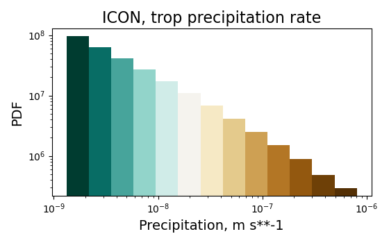

Tropical rainfall diagnostic
============================

The goal of tropical rainfall diagnostic is to provide fast and straightforward precipitation analysis in tropical or global areas. 

Overview of Available Diagnostics
---------------------------------

The current version of tropical rainfall diagnostic successfully achieves the minimal requirements: it can calculate the histograms 
in the form of xarrays.Dataset, which contains the counts, frequencies, and probability distribution functions (pdf) for specified bins.

The main attributes of `TR_PR_Diagnostic` Class
-----------------------------------------------

The most crucial attributes of the class are:

* `trop_lat (int or float)`:            

  the latitude of the tropical zone.  
  The default value of the attribute is equal to 10. 
  The user can easily modify the value tropical latitude band. The first way to do that is to set a new default value during the initialization of the class. 
 
    .. code-block:: python

      from tropical_rainfall_class import TR_PR_Diagnostic as TR_PR_Diag
      diag = TR_PR_Diag(trop_lat=20)

  Another way is to modify the tropical latitude after the initialization of the class: 
  
    .. code-block:: python

      diag.trop_lat=15

  The user can modify the latitude band by parsing the argument `trop_lat` to the functions of the class. 
  In this instance, a function uses a new value for 'trop_lat' and modifies the class's default value. For example:
  
    .. code-block:: python

      diag.histogram(ifs, trop_lat=90)
      diag.trop_lat
  
  While the user has specified 'trop_lat=90', the diagnostic will calculate global precipitation instead of tropical. 

  **Note:** All class attributes are editable in the same way as the 'trop_lat' attribute.

* `num_of_bins (int)`:            
  the number of bins,

* `first_edge (int, float)`:    
  the first edge of the bin,

* `width_of_bin (int, float)`:  
  the width of the bin. 
  
  If the user initializes the `num_of_bins`, `first_edge`, and  `width_of_bin`,  
  the diagnostic will calculate the 
  histograms with **continuous uniform binning**, i.e., all bins in the histogram will have the same width.

* `bins (np.ndarray, list)`:            
  the bins.  If the user wants to perform the calculation for **non-uniform binning** (for example, log-spaced), 
  use the `bins` attribute of the diagnostic instead of `num_of_bins`, `first_edge`, and `width_of_bin`.

The class has the following time-related attributes, which help define the dataset's time band: 

* `s_time (int, str)`:          the start time of the time interval, 

* `f_time (int, str)`:          the end time of the time interval,

* `s_year (int)`:               the start year of the time interval, 

* `f_year (int)`:               the end year of the time interval,

* `s_month (int)`:              the start month of the time interval, 

* `f_month (int)`:              the end month of the time interval. 

  The user can specify `s_time` and `f_time` as integers. If the user needs to calculate 
  the histogram for the first 100 time steps, he can initialize the diagnostic as follows: 
  
    .. code-block:: python

      diag = TR_PR_Diag(bins=bins, s_time=0, f_time=100)
      diag.histogram(mswep)

  The user can specify `s_time` and `f_time` as strings with any separators between year/month/day/hour/minute:
  
    .. code-block:: python

      diag.s_time = '2020:01'
      diag.f_time ='2020/03/20/12'

  There is the option to specify the year range:

    .. code-block:: python

      diag.s_year = 2020
      diag.f_year = 2025

  or month range:

    .. code-block:: python

      diag.s_month = 3
      diag.f_month = 6

  or both the year and month range at the same time:

    .. code-block:: python

      diag.s_year = 2012
      diag.s_month = 9
      diag.f_month = 11

All class attributes are optional, but the time-related attributes are of lesser diagnostic relevance.

**Reminder**: Although all attributes are optional, the user must define or `bins` attribute of the diagnostic 
or `num_of_bins`, `first_edge`, and `width_of_bin` for histogram calculation.

The histogram calculation
-------------------------

The most straightforward illustration of a histogram calculation

* with continuous uniform binning:

  .. code-block:: python

      diag = TR_PR_Diag(num_of_bins = 20, first_edge = 0, width_of_bin = 1*10**(-5))
      diag.histogram(ifs)

* with the log-spaced binning:

  .. code-block:: python

      diag = TR_PR_Diag()
      bins = numpy.logspace(-9, -6, 15)
      diag.histogram(ifs)

* with weights
  
    .. code-block:: python

        diag.histogram(icon, weights=reader.grid_area)

  Compared to standard methods, such computations 
  are `high-speed` because they are based on `dask_histogram` package (see `env-tropical-rainfall.yml` file).

  
The output of the histogram function is xarray.Dataset, which has two coordinates 

* `center_of_bin`:   the center of each bin

* `width`:           width of each bin

We used two coordinated instead of one to allow the user usage of not uniformal binning if needed. 

The xarray.Dataset  contains three variables:

* `counts`:       the number of observations that fall into each bin

* `frequency`:    the number of cases in each bin, normalized by the total number of counts. The sum of the frequencies equals 1.

* `pdf`:          the number of cases in each bin, normalized by the total number of counts and width of each bin. 

The obtained xarray.Dataset contains both local and global attributes. 
Local attributes specify the time and space grid for which the diagnostic performed calculations:

* `time_band`:    the value of time of the first and last element in the dataset and the frequency of the time grid,

* `lat_band`:     the maximum and minimum values of the tropical latitude band and the frequency of the latitude grid,

* `lon_band`:     the maximum and minimum values of the longitude and the frequency of the longitude grid.

Global attribute `history` contains the information about when the histogram was calculated and values of `time_band`, `lat_band`, and `lon_band`.

The lazy mode 
--------------

The user can calculate the histogram of global or tropical precipitation in the so-called lazy (or delayed) mode. 
To do this, the user needs to set the `lazy`` flag to True.

  .. code-block:: python

    hist_icon_lazy=diag.histogram(icon, lazy=True)

If the user is ready to compute the histogram, 
he can apply the function `histogram_to_xarray` to add frequency and pdf variables to the dataset.
The function `data_with_global_atributes` argument is needed to populate Dataset with global attributes: 

  .. code-block:: python

    diag.histogram_to_xarray(hist_counts=hist_icon_lazy, data_with_global_atributes=icon)

Output 
------

The diagnostic already provides unique names for the files which contain the histogram.  
The file's name includes the first and last time steps, for which the diagnostic does the calculations, in the following format: `year-month-day-hour`. 
The name of the file, which the user specified, would be added at the beginning of the file name. 
For example, for one day of the icon data (`freq=30m`) 

  .. code-block:: python

    path_to_save='/work/bb1153/b382267/AQUA/histograms/'
    diag.save_histogram(dataset=hist_icon, path_to_save=path_to_save, name_of_file='icon')

the name of the histogram is `icon_2020-01-20T00_2020-01-20T23_histogram.pkl`.

List of histograms 
------------------

The diagnostic can combine any number of histograms into a single histogram, recalculating 
the frequencies and pdf values and modifying the attributes automatically.

If you want to merge all histograms if the specified repository, set the following flag: `all=True.`

  .. code-block:: python

    path_to_histograms='/path/to/folder/with/histograms/'

    merged_histograms = diag.merge_list_of_histograms(path_to_histograms=path_to_histograms, all=True)
    merged_histograms

**Reminder**: Store the obtained histograms for distinct models in separate repositories to avoid possible errors. 

If you want to merge only a specific number of histograms, set the function `multi`-argument. 
The function will sort the files in the repository and take the first `multi` number of histograms in the repository.

  .. code-block:: python

    path_to_histograms='/path/to/folder/with/histograms/'

    merged_histograms = diag.merge_list_of_histograms(path_to_histograms=path_to_histograms, multi=10)
    merged_histograms

The histogram plots 
-------------------

The diagnostic contains the simple in-the-use function to create the histogram plot. 
The user can create plots of the obtained data in  different styles and scales. 

The simplest way to plot the histogram is:

  .. code-block:: python
    diag.hist_figure(hist_icon) 

The function `hist_figure` has an extensive set of arguments.

#. The first and major group of arguments relates to the histogram type: 

   * `pdf`-histogram: `pdf=True`, also it is the default value, 

   * `frequency`-histogram: `frequency=True, pdf=False`,

   * `counts`-histogram: `frequency=False, pdf=False`.

#. The second group of arguments related to the plot style:

   * `smooth` (bool, True by default): if True, smooth 2D line

   * `step` (bool, False by default): if True, step line 

   * `color_map` (bool/str, False/'viridis' by default): if not False, color map plot

#. The third set of arguments involves the figure settings:

   * `ls` (str, '-'): The line style for the plot. 

   * `ylogscale` (bool, True): The logarithmic scale for the y-axis. 

   * `xlogscale` (bool, False): The logarithmic scale for the x-axis. 

   * `color` (str, 'tab:blue'): The color of the plot. 
 
   * `figsize` (float, 1): The size of the figure. 

   * `legend` (str, '_Hidden'): The legend label for the plot. 

   * `varname` (str, 'Precipitation'): The variable's name for the x-axis label. 

   * `plot_title` (str, None): The plot's title.
 
   * `loc` (str, 'upper right'): The location of the legend. 

   * `add/fig` (tuple, None): Tuple of (fig, ax) to add the plot to an existing figure. / The figure object to plot on.

   * `path_to_figure` (str, None): The path to save the figure. If provided, saves the figure at the specified path.

Below is an additional example of a histogram plot.

  .. code-block:: python
    diag.hist_figure(histogram, smooth = False, color_map = 'gist_heat', figsize=0.7, 
               xlogscale = True, ylogscale=True,  plot_title = "ICON, trop precipitation rate")

You can find an example of the histogram obtained with the tropical-rainfall diagnostic below. 

    The pdf of tropical precipitation of the ICON data. 

Notebooks 
---------

The notebook folder contains the following notebooks:

 - `ICON histogram calculation <https://github.com/oloapinivad/AQUA/blob/devel/trop_rainfall_core/diagnostics/tropical-rainfall-diagnostic/notebooks/ICON_histogram_calculation.ipynb>`_: 

    The notebook demonstrates the major abilities of tropical rainfall diagnostic: 
    - initialization of an object of the diagnostic class, 
    - selection of the class attributes,  
    - calculation of the histograms in the form of xarray, 
    - saving the histograms in the storage,
    - and loading the histograms from storage.

 - `ICON histogram plotting <https://github.com/oloapinivad/AQUA/blob/devel/trop_rainfall_core/diagnostics/tropical-rainfall-diagnostic/notebooks/ICON_histogram_plotting.ipynb>`_:

    The notebook demonstrates the abilities of the histogram plotting functions:
    - selection of the plot style: step line style, 2D smooth line style, and different color maps,
    - selection of the plot size, axes scales, 
    - saving plot into storage, 
    - plotting the counts, frequencies, and Probability density function (pdf) from the obtained histograms.
 - `diagnostic during streaming <https://github.com/oloapinivad/AQUA/blob/devel/trop_rainfall_core/diagnostics/tropical-rainfall-diagnostic/notebooks/diagnostic_vs_streaming.ipynb>`_:

    The notebook demonstrates the usage of diagnostic during the streaming mode:
    - saving the obtained histogram with the histogram into storage per each chunk of any data during the stream, 
    - loading all or multiple histograms from storage and merging them into a single histogram. 

 - `histogram comparison for different climate models <https://github.com/oloapinivad/AQUA/blob/devel/trop_rainfall_core/diagnostics/tropical-rainfall-diagnostic/notebooks/histogram_comparison.ipynb>`_:

    The notebook demonstrates:
    - a simple comparison of obtained histograms for different climate models, 
    - the ability to merge a few separate plots into a single one. 

 - `The applications of the diagnostic <https://github.com/oloapinivad/AQUA/blob/devel/trop_rainfall_core/diagnostics/tropical-rainfall-diagnostic/notebooks/diagnostic_example_for_2t.ipynb>`_:

    The notebook illustrates that:
    - The tropical precipitation diagnostic can be applied to any climate model variable.  

