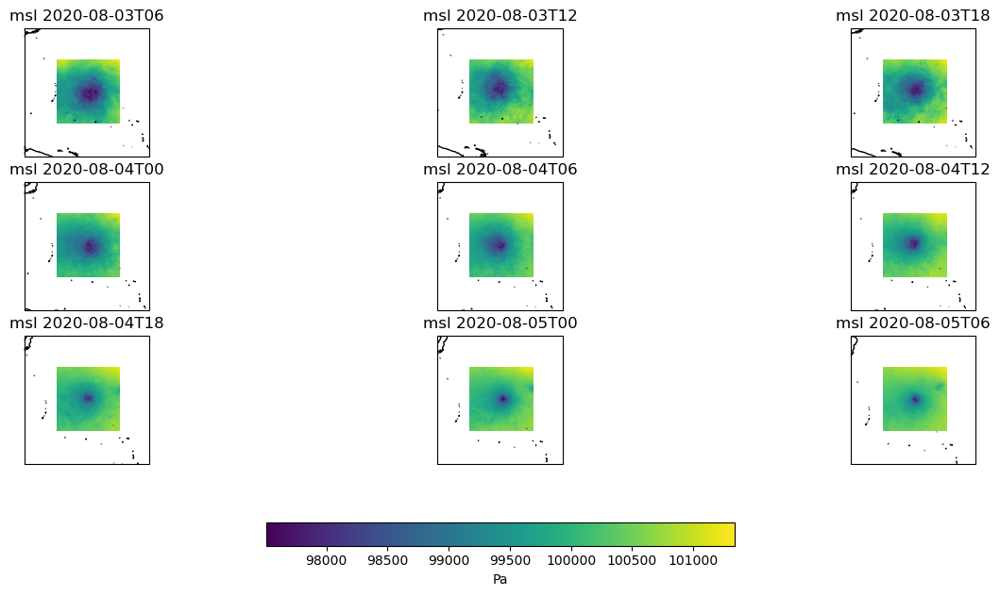
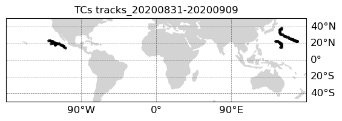

Tropical Cyclones detection, tracking and zoom in diagnostic
============================================================

Description
-----------

This diagnostic package provides a tool to detect tropical cyclones (TCs) and compute their trajectory. Moreover it allows one to save selected variables
in the vicinity of the TCs centres. The purpose of this diagnostic is to analyse how some variables of interest such as pressure, wind, wind gusts and precipitation
associated with tropical cyclones are represented in high-resolution climate simulations, in particular their intensity and spatial pattern. Detection and tracking
of TCs can be also used to compute TCs trajectories and compare them with other climate simulations and observations.

Structure
-----------

The dummy diagnostic follows a class structure and consists of the files:

* `notebooks/tropical_cyclones.ipynb`: a python notebook which provides an example use of the TCs diagnostic, including the TCs class initialisation,
                                 a wrapper function which calls the DetectNodes and StitchNodes functions from tempest-extremes (which now are implemented
                                 as methods of the TCs class) and saves the data in the vicinity of the detected TCs at each time step and for the TCs tracks
                                 in a considered time interval. Finally some plotting functions are included to plot some selected variables at a few time steps
                                 and the TCs tracks in a particular period;
* `tropical_cyclones_slurm.py`: a python file with the tropical cyclones diagnostic as in the notebook, but to be executed as script;
* `class_methods_TCs.py`: a python file in which the TCs class constructor and the other class methods are included; Some important methods are
                          readwrite_from_intake, which acess data through the reader and stores them in an input file for the tempest-extremes methods, 
                          DetectNodes (from tempest-extremes), which at each time step detects TCs centres, StitchNodes (tempest-extremes), which computes tracks from the
                          TCs centres detected and store_fullres_field, which store the selected variables (at the original model resolution)
                          in the vicinity of TCs centres for each track;
                          See the `methods` paragraph for a complete description of all methods and functions.
* `functions_TCs.py`: a python file which contains some functions (external to the tropical cyclones class) to analyse the output text files
                      produced by running the tempest-extremes methods DetectNodes and StitchNodes.
* `plotting.py`: a python file which contains the plotting functions;
* `run_TCs_slurm.sh`: bash script to run tropical_cyclones_slurm.py with sbatch;
* `env-TCs.yml`: a yaml file with the required dependencies to creat the environment for the TCs diagnostic;
* `config/config_levante.yml`: a yaml file in which all parameters are configured (including variables to save) and paths are specified. Version for Levante.
* `README.md` : a readme file which contains some tecnical information on how to install the tropical cyclones diagnostic and its environment. 

Input variables
---------------

* `msl`     (Mean sea level pressure, GRIB paramid 151)
* `z`       (Geopotential height, GRIB paramid 129 at 300 and 500 hPa and at the surface (orography))
* `10u`     (2m zonal wind, GRIB pramid 165)
* `10v`     (2m meridional wind, GRIB pramid 166)

Output 
------

Here is a list of files produced by the tropical cyclones diagnostic:

* tempest_output_yyyymmddThh.txt:            text files produced by Tempest DetectNodes with TCs centres coordinates and maximum wind at each time step; 
* tempest_track_yyyymmddThh-yyyymmddThh.txt: text files produced by Tempest StitchNodes with TCs centres coordinates and maximum wind; 
                                             for each TC trajectory (i.e. after tracking is applied); 
* TC_var_yyyymmddThh.nc:                     netcdf files with selected variables in the vicinity of each TC centre detected at each time step
* tempest_track_yyyymmddThh-yyyymmddThh.nc:  netcdf files with selected variables in the vicinity of each TC centre following TCs trajectories 
                                             (includes time dimension, yyyymmddThh-yyyymmddThh states the start-end period considered)

Example of outpud variables saved in the vicinity of TCs centres are:

* `msl`     (Mean sea level pressure, GRIB paramid 151)
* `10u`     (10m zonal wind, GRIB pramid 165)
* `10v`     (10m meridional wind, GRIB pramid 166)
* `pr`      (Total precipitation, GRIB pramid 228)
* `10fg`    (10m wind gust since the last postprocessing, GRIB pramid 49)

Figures include output variables in the vicinity of TCs centres at various time steps (useful to compare wind intensity, precipitation distribution
and intensity between original resolution and a coarser resolution or with observations) and a figure with all the TCs tracks in the period considered.

Methods used
------------

Examples from the DummyDiagnostic class contained in the class_methods_TCs.py file:

* "TCs": the tropical cyclones class;
* "catalog_init": initializes the Reader object for retrieving the atmospheric data needed (i.e. the input and output vars).
* "data_retrieve": retrieves atmospheric data from the Reader and stores them in data arrays. It includes the posibility
                   of simulating the streaming of data. It updates the stream_startdate and stream_enddate attributes if streaming is set to True.
* "set_time_window": updates the n_days_freq and n_days_ext attributes of the Detector object to set the time window for the tempest extremes analysis.
* "readwrite_from_intake": regrids the atmospheric data, saves it to disk as a netCDF file, and updates the tempest_dictionary and tempest_filein attributes of the Detector object.
* "run_detect_nodes: runs the tempest extremes DetectNodes command on the regridded atmospheric data specified by the tempest_dictionary and tempest_filein attributes, saves the output to disk, and updates the tempest_fileout attribute of the Detector object.
* "detect_nodes_zoomin": wrapper which calls the readwrite_from_intake, run_detect_nodes and store_detect_nodes methods in a time loop;
* "stitch_nodes_zoomin": wrapper which calls the run stitch_nodes and store_stitch_nodes methods in a time loop.
* "lonlatbox": creates a lon lat box of specified width (in degrees). Called to store the original resolution vars only in a box centred over the TCs centres.
* "write_fullres_field": function to write original resolution variables around TCs centres and their trajectories. Output produced in a netcdf file.

Functions used
--------------

The python file functions_TCs.py contains some functions used to analyse the raw output of tempest-extremes:

* "getNodes": Retrieves nodes (i.e. TCs centres in thi s case) from a TempestExtremes file (.txt output from DetectNodes).
* "getTrajectories": Retrieves trajectories from a TempestExtremes file (.txt file generated from StitchNodes).

These functions are largerly based on the ones found in the CyMeP repository by Colin Zarzycki (https://github.com/zarzycki/cymep).

Observations
------------

Tropical cyclones tracks and variables structure in the vicinity of TCs are compared with ERA5 reanalysis data.

References
----------

* tempest-extremes GitHub: https://github.com/ClimateGlobalChange/tempestextremes
* CyMeP GitHub: https://github.com/ClimateGlobalChange/tempestextremes
* Ullrich, P.A., C.M. Zarzycki, E.E. McClenny, M.C. Pinheiro, A.M. Stansfield and K.A. Reed (2021) "TempestExtremes v2.1: A community framework for feature detection, tracking and analysis in large datasets" Geosci. Model. Dev. 14, pp. 5023–5048, 
`DOI <10.5194/gmd-14-5023-2021>`. 
* Zarzycki, C. M., P. A. Ullrich, and K. A. Reed, 2021: Metrics for Evaluating Tropical Cyclones in Climate Data. J. Appl. Meteor. Climatol., 60, 643–660, `DOI <https://doi.org/10.1175/JAMC-D-20-0149.1>`.

Example Plot(s)
---------------

    Pressure in the vicinity of a tropical cyclone from IFS.

    
    Example of TCs tracks in a 10 day period from an IFS simulation.

Available demo notebooks
------------------------

Notebooks are stored in diagnostics/dummy-diagnostic/notebooks

* `dummy_class_readerwrapper.ipynb <https://github.com/oloapinivad/AQUA/blob/main/diagnostics/dummy/notebooks/dummy_class_readerwrapper.ipynb>`_
* `dummy_class_timeband.ipynb <https://github.com/oloapinivad/AQUA/blob/main/diagnostics/dummy/notebooks/dummy_class_timeband.ipynb>`_
        
Detailed API
------------

This section provides a detailed reference for the Application Programming Interface (API) of the "dummy" diagnostic,
produced from the diagnostic function docstrings.

.. automodule:: tropical_cyclones
    :members:
    :undoc-members:
    :show-inheritance:
