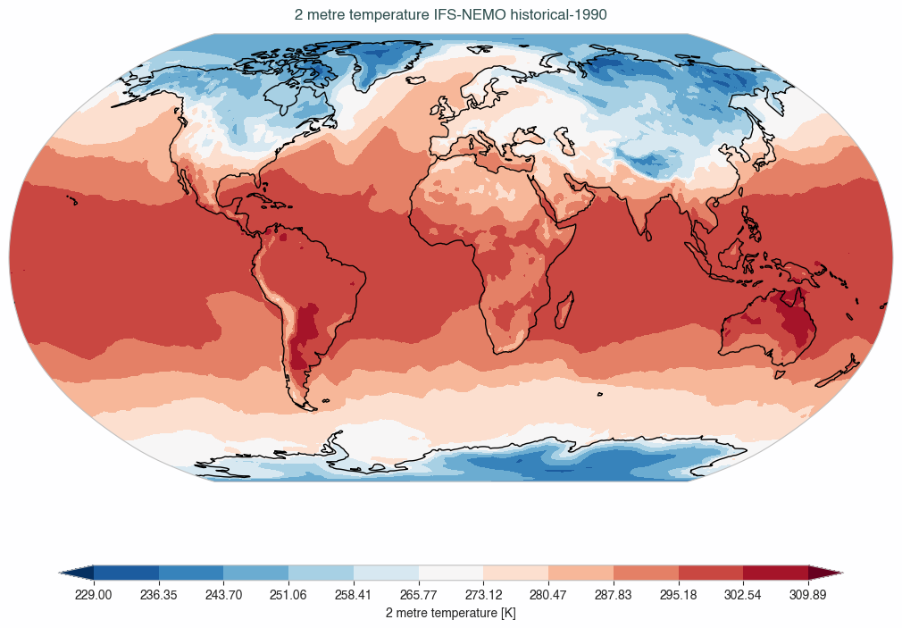
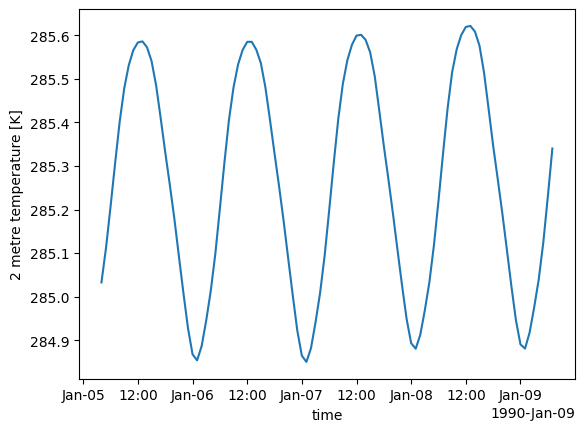

.. _getting_started:
Getting Started
===============

Basic Concepts
--------------

AQUA is designed to simplify the diagnostics process on high-resolution climate models. 
This is done by creating a series of tools that simplifies data access and basic data operations so that the 
users - diagnostics developers or climate researchers interested in accessing model data - can focus only on scientific analysis.
For this reason, whatever object accessed by AQUA is delivered as a `xarray <https://docs.xarray.dev/en/stable/>`_ object.
The package is built around a few core concepts:

- **Data reading and preprocessing**: Data are exposed through `intake <https://intake.readthedocs.io/en/stable/>`_ catalogues 
  and represented as `xarray <https://docs.xarray.dev/en/stable/>`_ objects. 
  This allows us to easily read and preprocess data from various sources, including local files, remote servers, 
  and cloud storage, from climate models and observational datasets.
- **Data fixing**: AQUA provides capabilities to change metadata (e.g., variable names) and data themselves
  (e.g., convert to different units or homogeneize coordinate names) so that model data reach the users with a common data format.
- **Regridding and interpolation**: AQUA offers robust regridding and interpolation functionalities 
  to align datasets with different grids and spatial resolutions.
- **Averaging and aggregation**: AQUA provides tools to perform temporal and spatial averaging and aggregation of climate data.
- **Parallel processing**: AQUA supports parallel processing through `dask <https://examples.dask.org/xarray.html>`_ to 
  speed up the execution of diagnostics.
- **Lazy evaluation**: AQUA uses `xarray <https://docs.xarray.dev/en/stable/>`_ to represent data, 
  which allows for lazy evaluation of operations, meaning that the data are not loaded into memory until they are needed.
- **Diagnostics**: most importantly, AQUA includes a set of built-in diagnostic tools,
  and it allows users to create custom diagnostics as well.

Installation
------------

Installation can be done using `mamba <https://mamba.readthedocs.io/en/latest/>`_.
Containers and tools specific to the machines used in the project are available.
Please refer to the :ref:`installation` section for more information.

Set up environment variables
----------------------------

To work with the AQUA package it is strongly recommended to set up an environment variable
to specify the path to the AQUA package. This can be done by adding the following line to
your `.bashrc` or `.bash_profile` file:

.. code-block:: bash

    export AQUA=/path/to/aqua

This will allow you to use the AQUA package from any location on the system and will make
clear for the code where to find the AQUA catalogue.

Set up the configuration file
-----------------------------

A configuration file is available to specify the parameters for the AQUA package.
This is a YAML file located in `config/config-aqua.yaml`.

The configuration file is used to specify the following parameters:

- **machine**: the machine on which the code is running. This is used to specify the
  location of the AQUA catalogue and the location of the data. Default is ``lumi``.
  Other options are ``ci`` and ``levante``. Custom machines can be defined (see :ref:`new-machine`).
- **reader**: this block contains catalogue and fixes location. These paths are intended to be
  inside the AQUA repository, so that these paths should not be changed if not necessary.
  Refer to :ref:`add-data` for more information.
- **cdo**: location of the CDO executable. By default this option is not needed, since CDO is required in the ``environment.yml`` file
  and provided by conda.

The configuration folder has this structure:

.. code-block:: text

    ├── config
    │   ├── data_models
    │   ├── fixes
    │   └── machines
    │       ├── lumi
    │       │   ├── catalog 
    │       │   ├── catalog.yaml
    │       │   └── regrid.yaml
    │       ├── levante
    │       └── ...
    ├── aqua-grids.yaml
    ├── config-aqua.yaml

Set up Jupyter kernel
---------------------

You need to register the kernel for the aqua environment to work with the AQUA 
package in Jupyter Hub on HPC systems.

Activate the environment and register the kernel with the following command:

.. code-block:: bash

    mamba activate aqua
    python -m ipykernel install --user --name=aqua

.. warning::

    If you are using a container and you want to use a Jupyter notebook, you need to
    follow some additional steps. Please refer to the :ref:`container` section for more information.

Example use case
----------------

Now that AQUA is installed in our favourite machine, let's see how to use it.
We will explore here a little example using the AQUA framework.
No diagnostic is involved here, this can be found in the :ref:`diagnostics` section.

We will walk you through an example using AQUA to interpolate atmospherically
temperature data to 1°x1° grid, plot a timestep of it and
then calculate the mean global temperature time series on the original grid.
This can be done in a few lines of code and using a Jupyter notebook.

Let's start with retrieving the data from the catalogue.

.. code-block:: python

    from aqua import Reader

We then instantiate the reader object.
To access a catalogue entry, a three layer structure is used: ``model``, ``exp`` and ``source``.
While doing so we specify the target grid to which we want to interpolate the data
and we turn on fixing of the data, so that the data are delivered in a common format.
Notice that ``fix=True`` is the default option, so we could have omitted it.

.. code-block:: python

    reader = Reader(model="IFS-NEMO", exp="historical-1990", source="hourly-hpz7-atm2d",
                    regrid='r100', fix=True)

This will create a reader object that will allow us to access the data from the catalogue.
Data are not retrieved yet at this stage and eventually we can specify variables and time range while accessing the data.

We now retrieve the data.

.. code-block:: python

    data = reader.retrieve()

We are asking for the data to be retrieved and a xarray object is returned,
so that only metadata are loaded into memory.
This allows us to retrieve blindly the data, without worrying about the size of the data.
We can then, in the development stage, explore the data and see what we have.
In a production environment instead, AQUA can be used to retrieve only variables and time ranges of interest.

.. note::
  Data are retrieved as an xarray object, specifically a ``xarray.Dataset``, even in the case we asked for a single variable.

We can now interpolate the data to a 1°x1° grid and plot a timestep of it, all with AQUA tools.

.. code-block:: python

    data_2t_r = reader.regrid(data['2t']) # This is an xarray.DataArray
    data_2t_r.isel(time=0).aqua.plot_single_map()

We obtain as image:

We used the regrid method to interpolate the data to a 1°x1° grid, with preprocessing of the weights already done
while initializating the Reader.
We then used the ``plot_single_map()`` function to plot the first timestep of the data.
This function has been used as accessor but can also be called as a standalone function.
See :ref:`accessors` for more information.

We can now calculate the mean global temperature time series on the original grid.
We will then go back to use the original data, without regridding them,
to show area evaluation capabilities of AQUA.

.. code-block:: python

    global_mean = reader.fldmean(data['2t'].isel(time=slice(100,200)))
    global_mean.plot()

We obtain as image:

For more detailed examples and tutorials, refer to the :ref:`examples_tutorials` section of this documentation
or explore the Jupyter notebooks provided with AQUA.
