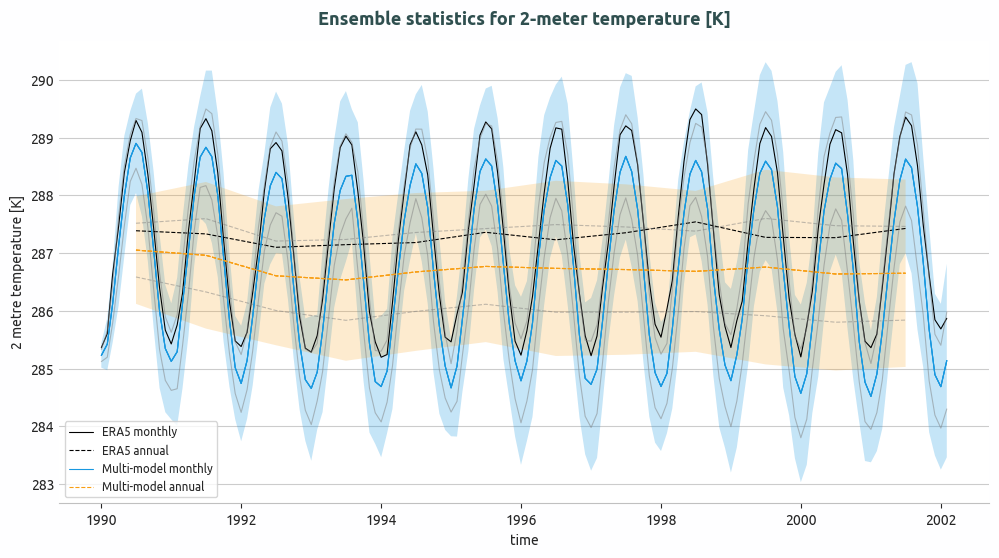
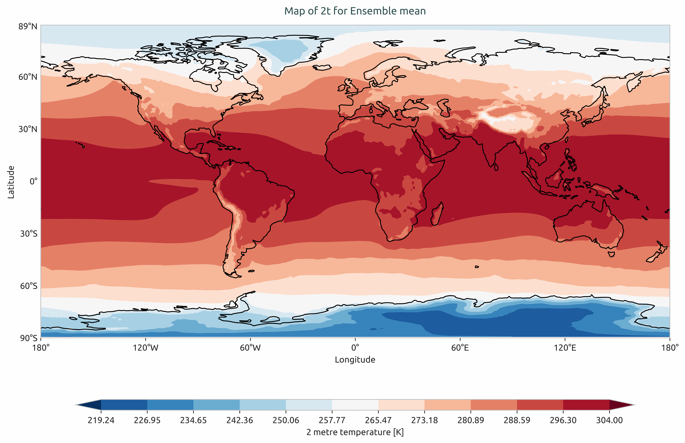
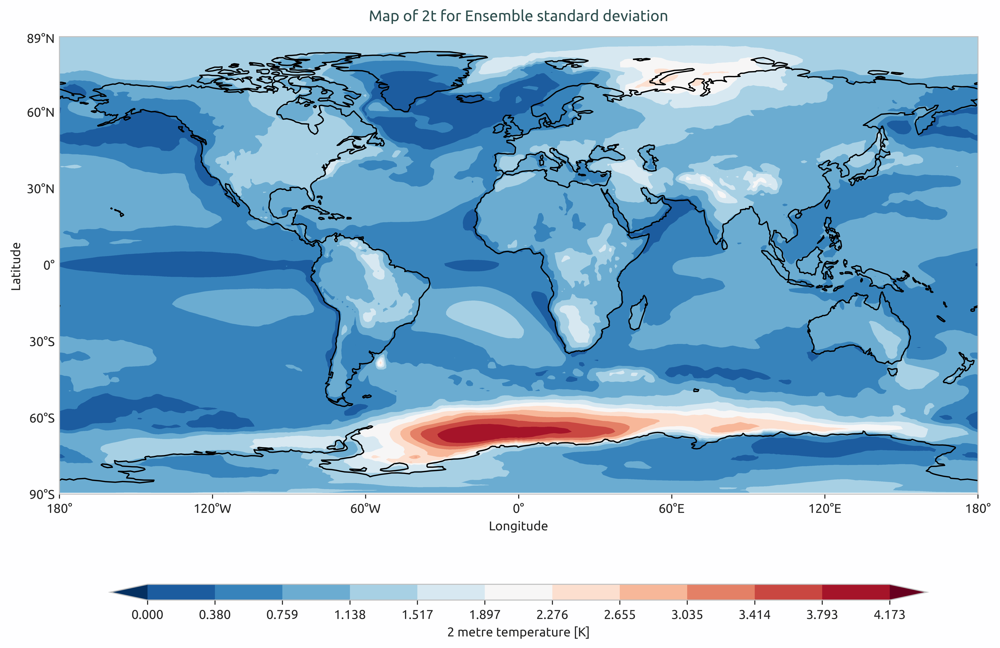
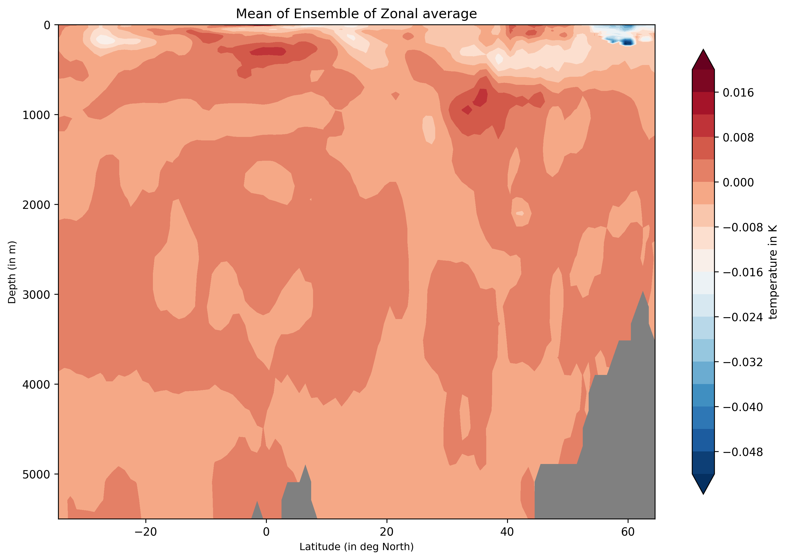
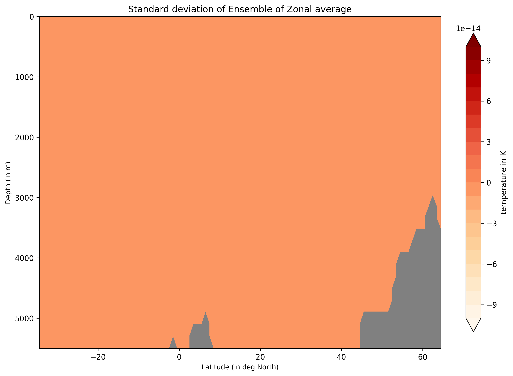

Ensemble Statistics
===================

Description
-----------

The `Ensemble` module is a tool to perform uncertainty quantification and visualising the ensemble statistics namely, mean and standard deviation.
It is also possible to calculate the weighted mean and standard deviation in case of multi-model ensemble.  
This module contains three main classes namely, `EnsembleTimeseries`, `EnsembleLatLon` and `EnsembleZonal`. 
Additionally, this module also contains three supporting plotting classes namely, `PlotEnsembleTimeseries`, `PlotEnsembleLatLon` and `PlotEnsembleZonal`. 

The `EnsembleTimeseries` class takes `1D` `xarray.Dataset` timeseries as input and performs following functionalities:
- Computes ensemble mean and standard deviation (Point-wise along time axis) for monthly and annual timeseries.

The `PlotEnsembleTimeseries` class takes `1D` `xarray.Dataset` timeseries as input and performs the following functionalities:
- Plots the ensemble-mean and 2x ensemble-std ± ensemble-mean along the given timeseries. 
- Note that the standard deviation is Point-wise along time axis.
- A reference timeseries can also be plotted. 

The `EnsembleLatLon` class takes `2D` `LatLon` `xarray.Dataset` as input and performs the following functionalities:
- Compute ensemble mean and standard deviation for `2D` Maps.

The `PlotEnsembleLatLon` class takes `2D` `LatLon` `xarray.Dataset` as input and performs the following functionalities:
- Plots the ensemble mean and standard deviation separately on two different maps.

The `EnsembleZonal` class take zonal-averages `Lev-Lon` `xarray.Dataset` as input and performs the following functionalities:
- Computes ensemble mean and standard deviation of the given input.

The `PlotEnsembleZonal` class take zonal-averages `Lev-Lon` `xarray.Dataset` as input and performs the following functionalities:
- Plots the ensemble mean and standard deviation of the computed statistics. 

Structure
---------

* ``ensembleTimeseries.py``: contains the `EnsembleTimeseries` class.
* ``plot_ensemble_timeseries.py``: contains the `PlotEnsembleTimeseries` class.
* ``ensembleLatLon.py``: contains the `EnsembleLatLon` class.
* ``plot_ensemble_latlon.py``: contains the `PlotEnsembleLatLon.py` class.
* ``ensembleZonal.py``: contains the `EnsembleZonal` class.
* ``plot_ensemble_zonal.py``: contains the `PlotEnsembleLatLon.py` class.
* ``cli_timeseries_ensemble.py``: the command line interfance (CLI) script to run the ensemble-timeseries `1D` diagnostic.
* ``cli_global_2D_ensemble.py``: the command line interfance (CLI) script to run the ensemble-2D-maps in `Lat-Lon` diagnostic.
* ``cli_zonal_ensemble.py``: the command line interfance (CLI) script to run the ensemble-zonal `Lev-Lon` diagnostic.
* ``util.py``: contains the `retrieve_merge_ensemble_data` and `compute_statistics` functions.
* ``base.py``: contains the base class which contains functions for saving the output as png, pdf and netcdf.
* ``config/diagnostics/ensemble/config_global_2D_ensemble.yaml``: config file for `cli_global_2D_ensemble.py`.
* ``config/diagnostics/ensemble/config_timeseries_ensemble.yaml``: config file for `ensembleTimeseries.py`.
* ``config/diagnostics/ensemble/config_zonalmean_ensemble.yaml``: config file for `ensembleZonal.py`.

Input variables
---------------

In order to use the `Ensemble` module, a pre-processing step is required. To load and to merge the input data, `aqua.diagnostics.ensemble.util.retrieve_merge_ensemble_data` can be used which takes the list of paths of data or uses catalog entries. In this step one has to merge all the given `1D` timeseries, `2D` `Lat-Lon` Map and Zonal-averages `Lev-Lon` for `EnsembleTimeseries`, `EnsembleLatLon` and `EnsembleZonal` along a pesudo-dimension, respectively. The default dimension is simply named as `ensemble` and can be changed. One can load the data directly as `xarray.Dataset` or can use the `aqua` `Reader` class. For example loading and merging a 2D maps ensemble into an `xarray,Dataset`: 

.. code-block:: python
   
   import glob
   from  aqua.diagnostics import retrieve_merge_ensemble_data
   
   file_list = glob.glob('/work/ab0995/a270260/pre_computed_aqua_analysis/*/historical-1990/atmglobalmean/netcdf/atmglobalmean.statistics_maps.2t.*_historical-1990.nc')
   file_list.sort()
   ens_dataset = retrieve_merge_ensemble_data(
       variable='2t', 
       model_names= ['IFS-FESOM', 'IFS-NEMO'], 
       data_path_list=file_list, 
       log_level = "WARNING",
       ens_dim="ensemble",
   )

A seond method:

.. code-block:: python

   ens_dataset = retrieve_merge_ensemble_data(
       variable='2t',
       catalog_list=['null', 'null'],
       models_catalog_list=['IFS-FESOM', 'IFS-NEMO'],
       exps_catalog_list=['historical-1990', 'historical-1990'],
       sources_catalog_list=['aqua-atmglobalmean', 'aqua-atmglobalmean'],
       log_level="WARNING",
       ens_dim="ensemble",
   )

The default values for the plotting fuction has been already set as default values. These values can also be by simply defining a python `dictionary` e.g., in the case of the `EnsembleTimeseries`,
``plot_options = {'plot_ensemble_members': True, 'ensemble_label': 'Multi-model', 'plot_title': 'Ensemble statistics for 2-meter temperature [K]', 'ref_label': 'ERA5', 'figure_size': [12,6]}``.

For `EnsembleLatLon`, 
``plot_options = {'figure_size': [15,14], 'cbar_label': '2-meter temperature in K','mean_plot_title': 'Map of 2t for Ensemble Multi-Model mean', 'std_plot_title': 'Map of 2t for Ensemble Multi-Model standard deviation'}``.

For `EnsembleZonal`, 
``plot_options = {'figure_size': [12,8], 'plot_label': True, 'plot_std': True, 'unit': None, 'mean_plot_title': 'Mean of Ensemble of Zonal average', 'std_plot_title':  'Standard deviation of Ensemble of Zonal average', 'cbar_label': 'temperature in K', 'dpi': 300}``.
 
Basic usage
-----------

The basic usage of this diagnostics is explained with working examples in the notebooks provided in ``notebooks/diagnostics/ensemble`` directory. Additionally, a detailed command line interface is also avaiable in ``src/aqua_diagnostics/ensemble`` directory.

Notebooks are stored in ``notebooks/ensemble``:

* `ensemble_timeseries.ipynb <https://github.com/DestinE-Climate-DT/AQUA/blob/main/notebooks/diagnostics/ensemble/ensemble_timeseries.ipynb>`_
* `ensemble_global_2D.ipynb <https://github.com/DestinE-Climate-DT/AQUA/blob/main/notebooks/diagnostics/ensemble/ensemble_global_2D.ipynb>`_
* `ensemble_zonalaverage.ipynb <https://github.com/DestinE-Climate-DT/AQUA/blob/main/notebooks/diagnostics/ensemble/ensemble_zonalaverage.ipynb>`_

Example Plots
-------------

Ensemble module provides output plots as PDF and PNG. 

    
    Ensemble of multi-model global monthly and annual timeseries and compared with ERA5 global monthly and annual average. Models considered as IFS-NEMO and IFS-FESM.

    
    Ensemble mean of multi-model of global mean of 2-meter temperature. Models considered as IFS-NEMO and IFS-FESM.  

    
    Ensemble standard devation of multi-model of the global mean of 2-meter temperature. Models considered as IFS-NEMO and IFS-FESM.

    
    Ensemble-Zonal mean for average Time-mean sea water practical salinity for IFS-NEMO historical-1990.

    Ensemble-Zonal standard deviation for average Time-mean sea water practical salinity for IFS-NEMO historical-1990.

Detailed API
------------

This section provides a detailed reference for the Application Programming Interface (API) of the ``ensemble`` diagnostic,
produced from the diagnostic function docstrings.

.. automodule:: aqua.diagnostics.ensemble
    :members:
    :undoc-members:
    :show-inheritance:

