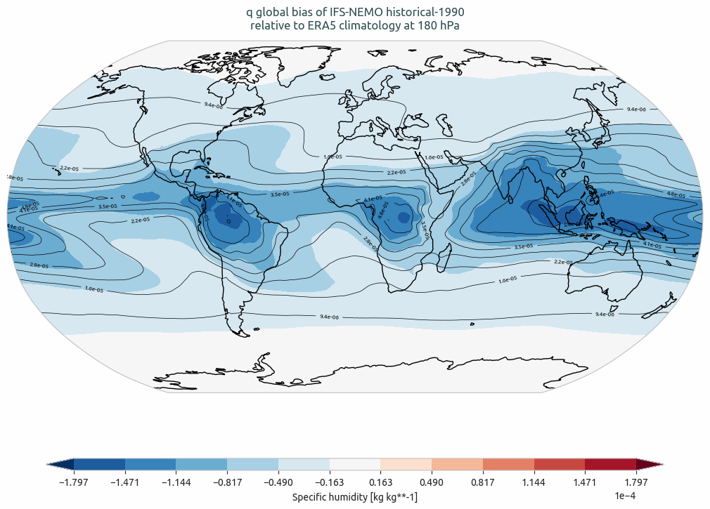
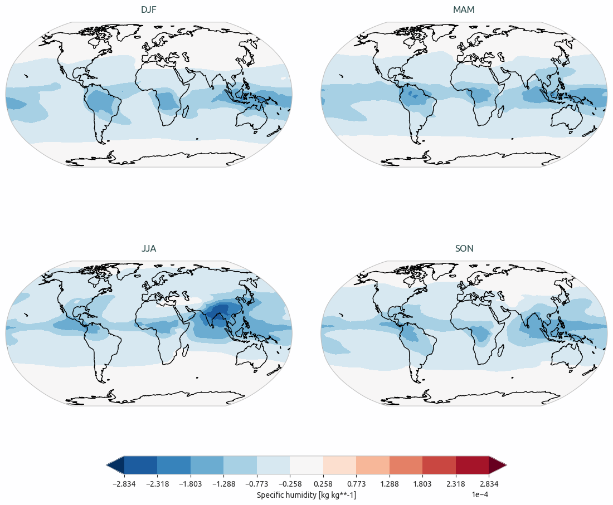

Global Biases Diagnostic
========================

Description
-----------

The GlobalBiases diagnostic  is a set of tools for the analysis and visualization of 2D spatial biases in climate model outputs.
It supports comparative analysis between a target dataset (typically a climate model) and a reference dataset, commonly an observational or reanalysis product such as ERA5. 
Alternatively, it can be used to compare outputs from two different model simulations, for example to assess differences between historical and scenario experiments.

GlobalBiases provides tools to plot:
- climatology maps
- bias maps
- seasonal bias maps
- vertical profiles to assess biases across pressure levels

The diagnostic is designed to have a class which analyse a single model to produce the netCDF files and another class to produce the plots.

Classes
-------
There is one class for the analysis and one for the plotting:

* **GlobalBiases**: the main class for the analysis of global biases.
It retrieves the data and prepares the data for plotting (e.g., regridding, pressure level selection, unit conversion).
It also handles the computation of mean climatologies, including seasonal climatologies if requested.
Climatologies are saved as class attributes and as netCDF files.

* **PlotGlobalBiases**: this class provides methods for plotting the global biases, seasonal biases, and vertical profiles.
 It generates the plots based on the data prepared by the GlobalBiases class.

File structure
--------------
* The diagnostic is located in the ``src/aqua_diagnostics/global_biases`` directory, which contains both the source code and the command line interface (CLI) script.
* The configuration files are located in the ``config/diagnostics/global_biases`` directory and contains the default configuration for the diagnostic.
* Notebooks are available in the ``notebooks/diagnostics/global_biases`` directory and contain examples of how to use the diagnostic.

Input variables and datasets
----------------------------

By default, the diagnostic compare against the ERA5 datasets, but it can be configured to use any other dataset as a reference.
A list of the variables that are compared automatically when running the full diagnostic is provided in the configuration files
available in the ``config/diagnostics/global_biases`` directory.

Some of the variables that are tipically used in this diagnostic are:

* 2m temperature (2t)
* Total Precipitation (tprate)
* Zonal and meridional wind (u, v)
* Specific humidity (q)

The diagnostic is designed to work with data from the Low Resolution Archive (LRA) of the AQUA project, which provides monthly data at a 1x1 degree resolution.
A higher resolution is not necessary for this diagnostic.

CLI usage
---------

The basic usage of this diagnostic is explained with a working example in the notebook provided in the ``notebooks/diagnostics/global_biases`` directory.
The basic structure of the analysis is the following:

.. code-block:: python

    from aqua.diagnostics import GlobalBiases, PlotGlobalBiases

    biases_ifs_nemo = GlobalBiases(model='IFS-NEMO', exp='historical-1990', source='lra-r100-monthly', loglevel="DEBUG")
    biases_era5 = GlobalBiases(model='ERA5', exp='era5', source='monthly', startdate="1990-01-01", enddate="1999-12-31", loglevel="DEBUG")

    biases_ifs_nemo.retrieve(var='q')
    biases_ifs_nemo.compute_climatology(seasonal=True)

    biases_era5.retrieve(var='q')
    biases_era5.compute_climatology(seasonal=True)
    
    pg = PlotGlobalBiases(loglevel='DEBUG')
    plot_biases.plot_bias(data=biases_ifs_nemo.climatology, data_ref=biases_era5.climatology, var='q', plev=18000)

.. note::

    The user can also define the start and end date of the analysis and the reference dataset.
    If not specified otherwise, plots will be saved in png and pdf format in the current working directory.

CLI usage
---------

The diagnostic can be run from the command line interface (CLI) by running the following command:

.. code-block:: bash

    cd $AQUA/src/aqua_diagnostics/global_biases
    python cli_global_biases.py --config_file <path_to_config_file>

Additionally the CLI can be run with the following optional arguments:

- ``--config``, ``-c``: Path to the configuration file.
- ``--nworkers``, ``-n``: Number of workers to use for parallel processing.
- ``--cluster``: Cluster to use for parallel processing. By default a local cluster is used.
- ``--loglevel``, ``-l``: Logging level. Default is ``WARNING``.
- ``--catalog``: Catalog to use for the analysis. It can be defined in the config file.
- ``--model``: Model to analyse. It can be defined in the config file.
- ``--exp``: Experiment to analyse. It can be defined in the config file.
- ``--source``: Source to analyse. It can be defined in the config file.
- ``--outputdir``: Output directory for the plots.

Config file structure
^^^^^^^^^^^^^^^^^^^^^

The configuration file is a YAML file that contains the following information:

* ``datasets``: a list of models to analyse (defined by the catalog, model, exp, source arguments).

.. code-block:: yaml

    datasets:
      - catalog: climatedt-phase1
        model: IFS-NEMO
        exp: historical-1990
        source: lra-r100-monthly
        regrid: null

.. note::
The diagnostic at the current stage is able to compare a single model against a single reference dataset. 
So the list should have only one entry.

* ``references``: a list of reference datasets to use for the analysis.

.. code-block:: yaml

    references:
      - catalog: obs
        model: ERA5
        exp: era5
        source: monthly
        regrid: null

.. note::
The diagnostic at the current stage is able to compare a single model against a single reference dataset. 
So the list should have only one entry.

* ``output``: a block describing the details of the output. Is contains:

    * ``outputdir``: the output directory for the plots.
    * ``rebuild``: a boolean that enables the rebuilding of the plots.
    * ``save_netcdf``: a boolean that enables the saving of the climatology as netCDF files.
    * ``save_pdf``: a boolean that enables the saving of the plots in pdf format.
    * ``save_png``: a boolean that enables the saving of the plots in png format.
    * ``dpi``: the resolution of the plots.

.. code-block:: yaml

    output:
      outputdir: "/path/to/output"
      rebuild: true
      save_netcdf: true
      save_pdf: true
      save_png: true
      dpi: 300

* ``globalbiases``: a block, nested in the ``diagnostics`` block, that contains the details required for the Global Biases diagnostic.
  The parameters specific to a single variable are merged with the default parameters, giving priority to the specific ones.

    * ``run``: a boolean that enables the execution of the diagnostic.
    * ``variables``: the list of variables to analyse.
    * ``plev``: the specific pressures level to analyse for 3D variables (e.g., [85000, 20000]).
    * ``seasons``: a boolean that enables the seasonal analysis.
    * ``seasons_stat``: the statistic to use for the seasonal analysis (e.g., 'mean').
    * ``vertical``: a boolean that enables the vertical profiles.
    * ``startdate_data``: the start date of the dataset.
    * ``enddate_data``: the end date of the dataset.
    * ``startdate_ref``: the start date of the reference dataset.
    * ``enddate_ref``: the end date of the reference dataset.

.. code-block:: yaml

    globalbiases:
        run: true
        variables: ['tprate', '2t', 'msl', 'tnlwrf', 't', 'u', 'v', 'q', 'tos']
        params:
            plev: [85000, 20000] # Level plot for 2D bias map if variable 3d
            seasons: true
            seasons_stat: 'mean' # May become a list
            vertical: true     # Vertical profile if variable 3d
            startdate_data: null
            enddate_data: null
            startdate_ref: "1990-01-01"
            enddate_ref: "2020-12-31"

* ``plot_params``: a block defining colorbar limits for plotting biases. Each variable can have its own range.

.. code-block:: yaml

    plot_params:
        limits:
            2d_maps:
                2t: {vmin: -15, vmax: 15}
                msl: {vmin: -1000, vmax: 1000}
                tnlwrf: {vmin: -40, vmax: 40}
                tprate: {vmin: -8, vmax: 8}
                vertical_maps:
                t: {vmin: -20, vmax: 20}
                u: {vmin: -50, vmax: 50}
                q: {vmin: -0.002, vmax: 0.002}

Output
------

The diagnostic produces four types of plots:
  * Global climatology maps. 
  * Global bias map of the model compared to the reference dataset.
  * Global bias map aof the model compared to the reference dataset for each season.
  * If the variable is 3d, a vertical profile of the bias of the model compared to the reference dataset at each pressure level.

These plots  are saved in a PDF and png format.

Observations
------------

The diagnostic uses ERA5 as a default reference dataset for the bias analysis.
Custom reference datasets can be used.

Example Plots
-------------

All these plots can be produced by running the notebooks in the ``notebooks`` directory on LUMI HPC.

    
    Climatology of q of IFS-NEMO historical-1990.

    
    Global bias of q of IFS-NEMO historical-1990 with respect to ERA5 climatology.

    Seasonal bias of q IFS-NEMO historical-1990 with respect to ERA5 climatology.

    Vertical bias of q  of IFS-NEMO historical-1990 with respect to ERA climatology.

Available demo notebooks
------------------------
Notebooks are stored in the ``notebooks/diagnostics/global_biases`` directory and contain examples of how to use the diagnostic.

* `global_biases.ipynb <https://github.com/DestinE-Climate-DT/AQUA/blob/main/notebooks/diagnostics/global_biases/global_biases.ipynb>`_

Authors and contributors
------------------------

This diagnostic is maintained by Silvia Caprioli (`@silviacaprioli <https://github.com/silviacaprioli>`_, `silvia.caprioli@polito.it <mailto:silvia.caprioli@polito.it>`_).
Contributions are welcome, please open an issue or a pull request.
If you have any doubt or suggestion, please contact the AQUA team or the maintainers.

Detailed API
------------

This section provides a detailed reference for the Application Programming Interface (API) of the ``timeseries`` diagnostic,
produced from the diagnostic function docstrings.

.. automodule:: aqua.diagnostics.global_biases
    :members:
    :undoc-members:
    :show-inheritance:
