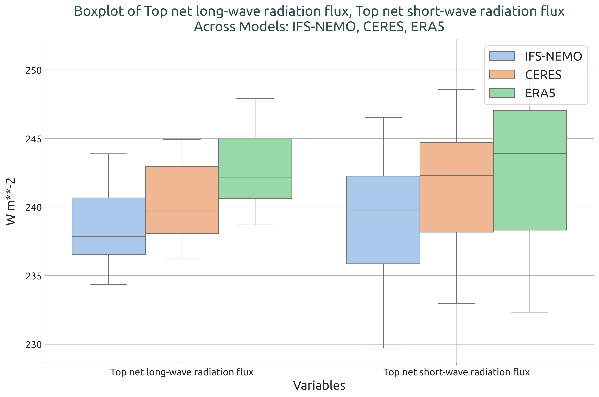

Radiation Budget Diagnostic
=============================

Description
-----------

The `Radiation` is designed to evaluate radiative budget imbalances at the top of atmosphere (TOA) and at the surface (SFC).
Currently, the  `Radiation` class includes only the function for generating boxplots, while time series and bias maps are produced by invoking other diagnostics in ``aqua-analysis`` using pecific configuration files.
The class can be extended in the future to incorporate additional radiation-specific features.

Structure
-----------

* ``radiation.py``: contains the `Radiation` class 
* ``cli_radiation.py``: the command line interface (CLI) script to run the diagnostic (boxplots only)

Input variables 
---------------

Radiative fluxes are usually analyzed by this diagnostic (even though a boxplot can be done for any variable).:

*  ``tnlwrf``:  top net long-wave radiation flux (total thermal radiation) ;
*  ``tnswrf`` : top net short-wave radiation flux (total solar radiation);
*  ``tnr`` : top net radiation (difference between the two above);

The data we retrieve from the LRA through the provided functions have monthly timesteps and a 1x1 deg resolution.
A higher resolution is not necessary for this diagnostic.

Basic usage
-----------

The basic usage of this diagnostic is explained with a working example in the notebook provided in the ``notebooks/diagnostics/radiation`` directory.
The basic structure of the analysis is the following:

.. code-block:: python

   from aqua import Reader
   from aqua.diagnostics import  Radiation

   #define and retrieve the data to use for the analysis
   reader_ifs_nemo = Reader(model = 'IFS-NEMO', exp = 'historical-1990', source = 'lra-r100-monthly')
   data_ifs_nemo = reader_ifs_nemo.retrieve()

   reader_era5 = Reader(model="ERA5", exp="era5", source="monthly")
   data_era5 = reader_era5.retrieve()

   datasets = [data_ifs_nemo, data_era5, data_ceres]
   model_names = ['IFS-NEMO', 'ERA5', 'CERES']
   variables = ['-tnlwrf', 'tnswrf']

   radiation = Radiation()
   result = radiation.boxplot(datasets=datasets, model_names=model_names, variables=variables)

.. note::

    A ``catalogs`` argument can be passed to the class to define the catalogs to use for the analysis.
    If not provided, the ``Reader`` will identify the catalogs to use based on the models, experiments and sources provided.

CLI usage
---------

The diagnostic can be run from the command line interface (CLI) by running the following command:

.. code-block:: bash

    cd $AQUA/src/aqua_diagnostics/radiation
    python radiation.py --config_file <path_to_config_file>

Additionally the CLI can be run with the following optional arguments:

- ``--config``, ``-c``: Path to the configuration file.
- ``--nworkers``, ``-n``: Number of workers to use for parallel processing.
- ``--loglevel``, ``-l``: Logging level. Default is ``WARNING``.
- ``--catalog``: Catalog to use for the analysis. It can be defined in the config file.
- ``--model``: Model to analyse. It can be defined in the config file.
- ``--exp``: Experiment to analyse. It can be defined in the config file.
- ``--source``: Source to analyse. It can be defined in the config file.
- ``--outputdir``: Output directory for the plots.

Config file structure
^^^^^^^^^^^^^^^^^^^^^

The configuration file ``config_radiation-boxplots`` is a YAML file that contains the following information:

* ``models``: a list of models to analyse (defined by the catalog, model, exp, source arguments)

.. code-block:: yaml

    models:
      - catalog: climatedt-phase1
         model: IFS-NEMO
         exp: historical-1990
         source: lra-r100-monthly
      - catalog: obs
         model: ERA5
         exp: era5
         source: monthly
      - catalog: obs
         model: CERES
         exp: ebaf-toa41
         source: monthly

* ``output``: a block describing the details of the output. Is contains:

    * ``outputdir``: the output directory for the plots.
    * ``rebuild``: a boolean that enables the rebuilding of the plots.
    * ``filename_keys``: a list of keys for constructing the output filenames.
    * ``save_netcdf``: a boolean that enables the saving of the plots in NetCDF format.
    * ``save_pdf``: a boolean that enables the saving of the plots in pdf format.
    * ``save_png``: a boolean that enables the saving of the plots in png format.
    * ``dpi``: the resolution of the plots.

* ``diagnostic_attributes``: a block with the following information:

    * ``variables``: the list of variables to analyse.
    * ``variable_names``: the list of variable names to use in the plots.

Output
------

The diagnostic generates plots saved in PDF and png format as well as NetCDF files. 

Observation
-----------

The diagnostic uses ERA5 and CERES as a default reference dataset for the radiation budget analysis.
Custom reference datasets can be used.

References
----------

* https://github.com/nextGEMS/nextGEMS_Cycle3/blob/main/IFS/radiation_evaluation.ipynb

Example plots
-------------
   

   
   Box plot to show the globally averaged incoming and outgoing TOA radiation of IFS-NEMO historical-1990 with respect to ERA5 and CERES climatologies

   
Available demo notebooks
------------------------

Notebooks are stored in ``diagnostics/global_biases/notebooks``:

* `radiation.ipynb <https://github.com/DestinE-Climate-DT/AQUA/blob/main/notebooks/diagnostics/radiation/radiation.ipynb>`_  
   
Detailed API
------------
This section provides a detailed reference for the Application Programming Interface (API) of the ``Radiation`` diagnostic, produced from the diagnostic function docstrings.

.. automodule:: aqua.diagnostics.radiation
    :members:
    :undoc-members:
    :show-inheritance:
